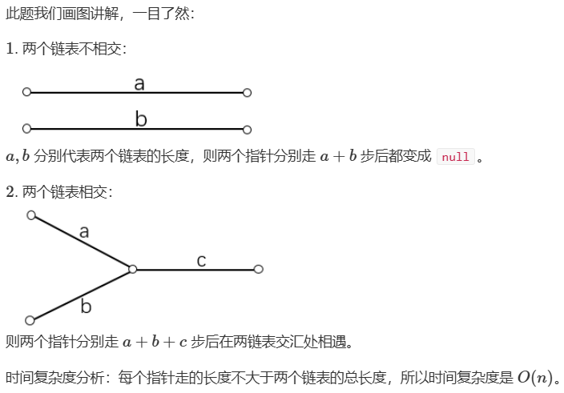
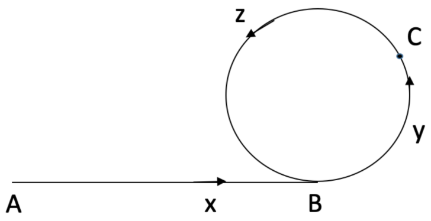

# 一、哈希

## [1. 两数之和 - 力扣（LeetCode）]([1. 两数之和 - 力扣（LeetCode）](https://leetcode.cn/problems/two-sum/description/?envType=study-plan-v2&envId=top-100-liked))

### 题解

> **法一：**哈希表。
>
> - 因为数据保证有且仅有一组解，假设解为 $[i, j], (i < j)$，则当我们遍历到 $j$ 时， $nums[i]$ 一定在哈希表中。
>
> **法二：**双指针。

### CODE

```c++
/*
法一：哈希表。
*/
class Solution { 
public:
    vector<int> twoSum(vector<int>& nums, int target) {
        vector<int> res;
        unordered_map<int,int> hash;
        for (int i = 0; i < nums.size(); i ++ ) {
            int another = target - nums[i];
            if (hash.count(another)) {
               	res.push_back(hash[another]);
                res.push_back(i);
                break;
            }
            hash[nums[i]] = i;
        }
        
        return res;
    }
};

/*
法二：双指针。
*/
class Solution { 
public:
    vector<int> twoSum(vector<int>& nums, int target) {
        vector<pair<int, int>> p;
        vector<int> res;

        for (int i = 0; i < nums.size(); i ++) p.push_back({nums[i], i});
        sort(p.begin(), p.end());

        int i = 0, j = p.size() - 1;
        while (i < p.size() && j >= 0) {
            if(p[i].first + p[j].first < target) i ++;
            else if ((p[i].first + p[j].first > target)) j --;
            else {
                res.push_back(min(p[i].second, p[j].second));
                res.push_back(max(p[i].second, p[j].second));
                break;
            }
        }
        
        return res;
    }
};
```


## [49. 字母异位词分组 - 力扣（LeetCode）](https://leetcode.cn/problems/group-anagrams/description/?envType=study-plan-v2&envId=top-100-liked)

### 题解

> **法一：**哈希表。
>
> - 由相同字母组成的字符串 $str$ ，排序后字符串 $key$ 都相等，将 $key$ 作为键， $str$ 作为值，维护一个 `unordered_map<string, vector<string>>` 的哈希表，每个 $key$ 对应，由相同字母组成的字符串 $str$，所组成的列表。

### CODE

```c++
class Solution {
public:
    vector<vector<string>> groupAnagrams(vector<string>& strs) {
        unordered_map<string, vector<string>> dict;
        for (auto it: strs) {
            string key = it;
            sort(key.begin(), key.end());
            dict[key].push_back(it);
        }

        vector<vector<string>> res;
        for(auto it: dict) {
            res.push_back(it.second);
        }
        
        return res;
    }
};
```


## [128. 最长连续序列 - 力扣（LeetCode）](https://leetcode.cn/problems/longest-consecutive-sequence/description/?envType=study-plan-v2&envId=top-100-liked)

### 题解

> **法一：**集合。
>
> - 首先将所有数字放入集合，遍历集合中的元素，因为要找连续的数字序列，因此可以通过向后枚举相邻的数字（即不断加一），判断后面一个数字是否在集合中即可。
>
> - 为了保证 $O(n)$ 的复杂度，需避免重复枚举序列，因此只对序列的起始数字向后枚举（例如 $[1,2,3,4]$，只对 $1$ 枚举，$2$，$3$，$4$ 时跳过），因此需要判断一下是否是序列的起始数字（即判断一下 $num-1$ 是否在集合中，若不在，则为起始数字）。

### CODE

```c++
class Solution {
public:
    int longestConsecutive(vector<int>& nums) {
        unordered_set<int> nums_set(nums.begin(), nums.end());

        int res = 0;
        for (auto num: nums_set) {
            if (!nums_set.count(num - 1)) { // 只考虑连续序列的起始元素，避免重复遍历序列
                int end = num;
                while (nums_set.count(end)) end ++;
                res = max(res, end - num);
            }
        }
        
        return res;
    }
};
```


# 二、双指针

## [283. 移动零 - 力扣（LeetCode）](https://leetcode.cn/problems/move-zeroes/description/?envType=study-plan-v2&envId=top-100-liked)

### 题解

> **法一：**双指针。
>
> - 指针 $r$ 表示当前访问到的位置，指针 $l$ 表示当前第一个可以放置**非零**元素的位置。

### CODE

```c++
class Solution {
public:
    void moveZeroes(vector<int>& nums) {
        int l = 0;
        for (int r = 0; r < nums.size(); r ++) {
            if (nums[r]) nums[l ++] = nums[r];
        }

        while (l < nums.size()) nums[l ++] = 0;
    }
};
```


## [11. 盛最多水的容器 - 力扣（LeetCode）](https://leetcode.cn/problems/container-with-most-water/description/?envType=study-plan-v2&envId=top-100-liked)

### 题解

>**法一：**双指针。
>
>- 最开始的时候，如果我们用指针 $l$ 和 $r$ 指向最两端的直线，此时两条直线之间的距离就是最大的，即我们所求矩形面积的宽度 $width$ 为最大。
>- 但是位于最两端的直线不一定是最高的，所以它们组成矩形的面积也就不一定是最大的。因此我们依然需要继续遍历整个数组，这时我们将指向数组两端的指针慢慢往里面收敛，直到找到面积最大值。
>- 对于此时 $l$ 和 $r$ 指向的直线，他们之间的宽度已经是最宽了。于是在收敛的过程中，如果遇到的高度比两端的柱子更低的话，由于之间的宽度更短，所以面积必定更小，我们就可以直接跳过，不予考虑。我们只需要考虑收敛时出现的那些高度更高的柱子。
>- 该方法在双指针向中间收敛的过程中，对数组中的每个元素只访问了一次，因此时间复杂度为 $O(n)$。

### CODE

```c++
class Solution {
public:
    int maxArea(vector<int>& height) {
        int l = 0, r = height.size() - 1;
        int res = 0;
        while (l < r)
        {
            int h = min(height[l], height[r]);
            res = max(res, h * (r - l));
            
            // 若 height[l] > h 则 l 不会更新
            // 若 height[r] > h 则 r 不会更新
            // 若 height[l] == height[r]，则 l、r 同时更新
            while (l < r && height[l] <= h) l ++; 
            while (l < r && height[r] <= h) r --;
        }
        
        return res;
    }
};
```


## [15. 三数之和 - 力扣（LeetCode）](https://leetcode.cn/problems/3sum/description/?envType=study-plan-v2&envId=top-100-liked)

### 题解

>**法一：**排序 + 双指针。
>
>- 枚举每个数，表示该数 $nums[i]$ 已被确定，在排序后的情况下，通过双指针 $l$ ， $r$ 分别从左边 $l = i + 1$ 和右边 $n - 1$ 往中间靠拢，找到 $nums[i] + nums[l] + nums[r] == 0$ 的所有符合条件的搭配。
>- 在找符合条件搭配的过程中，假设 $sum = nums[i] + nums[l] + nums[r]$，
>   - 若 $sum > 0$ ，则 $r$ 往左走，使 $sum$ 变小；
>   - 若 $sum < 0$ ，则$l$往右走，使 $sum$ 变大；
>   - 若 $sum == 0$ ，则表示找到了与 $nums[i]$ 搭配的组合 $nums[l]$ 和 $nums[r]$，存到 $res$ 中。
>- 判重处理：
>   - 当 $nums[i] == nums[i - 1]$，表示当前确定好的数与上一个一样，需要直接 $continue$。
>   - 当找符合 $sum == 0$ 时，需要对 $nums[l]$ 和 $nums[r]$ 进行判重。

### CODE

```c++
class Solution {
public:
    vector<vector<int>> threeSum(vector<int>& nums) {
        sort(nums.begin(), nums.end());
        vector<vector<int>> all_res;
        for (int i = 0; i < nums.size(); i ++) {
            if (i != 0 && nums[i] == nums[i - 1]) continue; // 判重
            
            int l = i + 1, r = nums.size() - 1;
            while (l < r) {
                int sum = nums[i] + nums[l] + nums[r];
                
                if (sum > 0) r --;
                else if (sum < 0) l ++;
                else {
                    vector<int> res = {nums[i], nums[l], nums[r]};
                    all_res.push_back(res);
                    // 对 nums[l] 和 nums[r] 进行判重
                    while (l < r && nums[++ l] == nums[l - 1]);
                    while (l < r && nums[-- r] == nums[r + 1]);
                }
            }
        }
        
        return all_res;
    }
};
```


## [42. 接雨水 - 力扣（LeetCode）](https://leetcode.cn/problems/trapping-rain-water/description/?envType=study-plan-v2&envId=top-100-liked)

### 题解

>**法一：**三次线性扫描。
>
>- 观察整个图形，考虑对水的面积按**列**进行拆解。
>
>- 注意到，每个矩形条上方所能接受的水的高度，是由它**左边最高**的矩形，和**右边最高**的矩形决定的。具体地，假设第 $i$ 个矩形条的高度为 $height[i]$，且矩形条左边最高的矩形条的高度为 $left_{max}[i]$，右边最高的矩形条高度为 $right_{max}[i]$，则该矩形条上方能接受水的高度为 $min(left_{max}[i],right_{max}[i]) - height[i]$。
>
>- 需要分别从左向右扫描求 $left_{max}$，从右向左求 $right_{max}$，最后统计答案即可。
>
>- 注意特判 $n$ 为 $0$。

### CODE

```c++
class Solution {
public:
    int trap(vector<int>& height) {
        int n = height.size(), ans = 0;
        if (n == 0)
            return 0;

        vector<int> left_max(n), right_max(n);

        left_max[0] = height[0];
        for (int i = 1; i < n; i++)
            left_max[i] = max(left_max[i - 1], height[i]);

        right_max[n - 1] = height[n - 1];
        for (int i = n - 2; i >= 0; i--)
            right_max[i] = max(right_max[i + 1], height[i]);

        for (int i = 0; i < n; i++)
            ans += min(left_max[i], right_max[i]) - height[i];

        return ans;
    }
};
```


# 三、滑动窗口

## [3. 无重复字符的最长子串 - 力扣（LeetCode）](https://leetcode.cn/problems/longest-substring-without-repeating-characters/description/?envType=study-plan-v2&envId=top-100-liked)

### 题解

> **法一：**双指针。
>
> - 定义指针 $l$ 和指针 $r$，表示当前扫描到的子串是 $[l, r]$（闭区间）。扫描过程中维护一个哈希表，表示 $[i,j] $中每个字符出现的次数。
> - 线性扫描时，每次循环的流程如下：
>   - 指针 $r$ 向后移一位，同时将哈希表中 $s[r]$ 的计数加一： $hash[s[r]]++$。
>   - 假设 $j$ 移动前的区间 $[l, r]$ 中没有重复字符，则 $r$ 移动后，只有 $s[r]$ 可能出现 $2$ 次。因此我们不断向后移动 $l$ ，直至区
>     间 $[l, r]$ 中  $s[r]$ 的个数等于 $1$ 为止。
> - 复杂度分析：由于 $l$ ,  $r$ 均最多增加 $n$ 次，且哈希表的插入和更新操作的复杂度都是 $O(1)$，因此，总时间复杂度 $O(n)$。

### CODE

```c++
class Solution {
public:
    int lengthOfLongestSubstring(string s) {
        unordered_map<char, int> hash;
        int res = 0;
        for (int l = 0, r = 0; r < s.size(); r ++) {
            hash[s[r]] ++;
            while (hash[s[r]] > 1) hash[s[l ++]] --;
            res = max(res, r - l + 1);
        }
        
        return res;
    }
};
```


## [438. 找到字符串中所有字母异位词 - 力扣（LeetCode）](https://leetcode.cn/problems/find-all-anagrams-in-a-string/description/?envType=study-plan-v2&envId=top-100-liked)

### 题解

> **法一：**双指针 + 哈希表（类似[49. 字母异位词分组 - 力扣（LeetCode）](https://leetcode.cn/problems/group-anagrams/description/?envType=study-plan-v2&envId=top-100-liked)）。
>
> - 使用哈希表记录 $p$ 的每个字符个数。
> - 使用指针 $l$ 和指针 $r$ 维护一个固定长度的滑动窗口，使用 $cnt$ 去维护窗口中有多少字符可以作为 $p$ 的异位字符，当 $cnt==p.size()$ 时，当前窗口构成的子串是 $p$ 的异位词：
>   - 指针 $r$ 向右访问 $s[r]$ 时，记录窗口中字符 $s[r]$ 的数量，若小于等于 $p$ 中该字符的数量，则说明 $s[r]$ 可以作为 $p$ 的一个异位字符，则 $cnt++$。
>   - 维护固定长度的滑动窗口：
>     - 若 $s[l]$ 的字符数量，小于等于 $p$ 中该字符的数量，说明 $s[l]$ 是 $p$ 的一个异位字符，则 $cnt--$；
>     - 指针 $l$ 右移，并维护窗口中字符 $s[l]$ 的数量，即 $sHash[s[l ++]] --$。

### CODE

```c++
class Solution {
public:
    vector<int> findAnagrams(string s, string p) {
        unordered_map<char, int> sHash, pHash;
		// 记录 p 的每个字符个数
        for (auto it: p) pHash[it] ++;

        vector<int> res;
        int cnt = 0;
        for (int l = 0, r = 0; r < s.size(); r ++) {
            sHash[s[r]] ++;
            
            // s[r] 可以作为 p 的一个异位字符，cnt ++
            if (sHash[s[r]] <= pHash[s[r]]) cnt ++;
            
            //维护固定长度的滑动窗口
            if (r - l + 1 > p.size()) {
                if (sHash[s[l]] <= pHash[s[l]]) cnt --;
                sHash[s[l ++]] --;
            }
            
            if (cnt == p.size()) res.push_back(l);
        }
        
        return res;
    }
};
```


# 四、子串

## [560. 和为 K 的子数组 - 力扣（LeetCode）](https://leetcode.cn/problems/subarray-sum-equals-k/description/?envType=study-plan-v2&envId=top-100-liked)

### 题解

> **法一：**前缀和 + 哈希表。
>
> - 对原数组求前缀和后，一个和为 $k$ 的子数组即为**一对前缀和的差值为 $k$ 的位置**。
> - 遍历前缀和数组，用哈希表记录每个前缀和出现的次数。特别地，初始时前缀和为 $0$ 需要被额外记录一次。
> - 遍历过程中，对于当前前缀和 $tot$，累加之前 $tot - k$ 前缀和出现的次数 ($tot-(tot-k)==k$ )。

### CODE

```c++
class Solution {
public:
    int subarraySum(vector<int>& nums, int k) {
        unordered_map<int, int> hash;
        hash[0] = 1;
        
        int tot = 0, res = 0;
        for (auto it: nums) {
            tot += it; // 计算前缀和
            res += hash[tot - k]; // 若存在和为 tot - k 的前缀和，则存在一个子数组和为 k 
            hash[tot] ++;
        }
        
        return res;
    }
};
```


## [239. 滑动窗口最大值 - 力扣（LeetCode）](https://leetcode.cn/problems/sliding-window-maximum/description/?envType=study-plan-v2&envId=top-100-liked)

### 题解

> **法一：**单调队列。

### CODE

```c++
class Solution {
public:
    vector<int> maxSlidingWindow(vector<int>& nums, int k) {
        int n = nums.size();

        vector<int> res, q(n + 7, 0); // 队列 q 存储的是下标
        int hh = 0, tt = -1;

        for (int i = 0; i < n; i ++) {
            if (hh <= tt && i - q[hh] + 1 > k) hh ++;
            while (hh <= tt && nums[q[tt]] <= nums[i]) tt --; // 注意，访问数组元素时，切记使用 nums[] 嵌套 q[] ，因为 q[] 存储的是下标
            q[++ tt] = i;
            if (i >= k - 1) res.push_back(nums[q[hh]]);
        }
        
        return res;
    }
};
```


## [76. 最小覆盖子串 - 力扣（LeetCode）](https://leetcode.cn/problems/minimum-window-substring/description/?envType=study-plan-v2&envId=top-100-liked)

### 题解

> **法一：**双指针 + 哈希表。
>
> - 思路与 $438$ 类似，需要注意的是 $76$ 的子串无需与 $t$ 等长。

### CODE

```c++
class Solution {
public:
    string minWindow(string s, string t) {
        unordered_map<char, int> sHash, tHash;
        for (auto it: t) tHash[it] ++;

        int cnt = 0;
        pair<int, int> res(0, s.size() + 7);
        for (int l = 0, r = 0; r < s.size(); r ++) {
            sHash[s[r]] ++;
            if (sHash[s[r]] <= tHash[s[r]]) cnt ++;
            
            while (l <= r && sHash[s[l]] > tHash[s[l]]) sHash[s[l ++]] --;
            
            if (cnt == t.size() && r - l <= res.second - res.first) res = {l, r};
        }
        
        if (cnt == t.size()) return s.substr(res.first, res.second - res.first + 1);
        else return "";
    }
};
```


# 五、普通数组

## [53. 最大子数组和 - 力扣（LeetCode）](https://leetcode.cn/problems/maximum-subarray/description/?envType=study-plan-v2&envId=top-100-liked)

### 题解

>**法一：**递推。
>
>- 每次考虑以下标 $i$ 结尾的子串最大和 $pre$。
>- 当考虑下标 $i + 1$ 时：
>  - 若 $pre >= 0$，则 $i + 1$ 的子串最大和，为 $pre + nums[i + 1]$。
>  - 若 $pre < 0$， 则 $i + 1$ 的子串最大和，为 $nums[i + 1]$。
>- 记录全局最大和 $res$ ，即 $res = max(res, pre)$。
>
>**法二：**分治。
>
>- 对于一个区间 $[l, r]$，维护四个值，分别是：总和 $sum$；非空最大子段和 $s$；前缀非空最大子段和 $ls$；后缀非空最大
>  子段和 $rs$。
>
>- 分别递归左右子区间并合并：
>
>  - 对于 $sum$ ，则是左右子区间的 $sum$ 之和。
>  - 对于 $s$ ，则有三种情况取最大值：
>    - 左区间的 $s$；
>    - 右区间的 $s$；
>    - 左区间的 $rs$ 加上右区间的 $ls$。
>  - 对于 $ls$ ，则有两种情况取最大值：
>    - 左区间的 $ls$；
>    - 左区间的 $sum$ 加上右区间的 $ls$。
>  - 对于 $rs$ 同理。
>
>  - 合并后返回递归的结果。

### CODE

```c++
/*
法一：递推。
*/
class Solution { 
public:
    int maxSubArray(vector<int>& nums) {
        vector<int> s(nums.size() + 7, 0);

        int res = nums[0], pre = nums[0];
        for (int i = 1; i < nums.size(); i ++) {
            if (pre < 0) pre = 0;
            pre += nums[i];
            res = max(res, pre);
        }

        return res;
    }
};

/*
法二：分治。
*/
struct Node {
    int sum, s, ls, rs;
    Node(int sum_, int s_, int ls_, int rs_) {
        sum = sum_; s = s_; ls = ls_; rs = rs_;
    }
};

class Solution {
public:
    Node solve(int l, int r, const vector<int> &nums) {
        if (l == r)
            return Node(nums[l], nums[l], nums[l], nums[l]);

        int mid = (l + r) >> 1;

        Node left = solve(l, mid, nums);
        Node right = solve(mid + 1, r, nums);

        return Node(
            left.sum + right.sum,
            max(max(left.s, right.s), left.rs + right.ls),
            max(left.ls, left.sum + right.ls),
            max(right.rs, left.rs + right.sum)
        );
    }

    int maxSubArray(vector<int>& nums) {
        return solve(0, nums.size() - 1, nums).s;
    }
};
```


## [56. 合并区间 - 力扣（LeetCode）](https://leetcode.cn/problems/merge-intervals/description/?envType=study-plan-v2&envId=top-100-liked)

### 题解

>**法一：**排序。

### CODE

```c++
class Solution {
public:
    vector<vector<int>> merge(vector<vector<int>>& intervals) {
        sort(intervals.begin(), intervals.end());

        int st = intervals[0][0], ed = intervals[0][1];
        vector<vector<int>> res;
        for (int i = 1; i < intervals.size(); i ++) {
            int l = intervals[i][0], r = intervals[i][1];
            
            if (l <= ed) ed = max(ed, r);
            else {
                res.push_back(vector<int>{st, ed});
                st = l, ed = r;
            }
        }
        res.push_back(vector<int>{st, ed});
        
        return res;
    }
};
```


## [189. 轮转数组 - 力扣（LeetCode）](https://leetcode.cn/problems/rotate-array/description/?envType=study-plan-v2&envId=top-100-liked)

### 题解

>**法一：**转置。

### CODE

```c++
class Solution {
public:
    void reverse(vector<int>& nums, int l, int r) {
        for (int i = l; i <= l + r >> 1; i ++) {
            swap(nums[i], nums[r - i + l]);
        }
    }
    void rotate(vector<int>& nums, int k) {
        int n = nums.size();
        k %= n; // 注意取余
        reverse(nums, 0, n - k - 1);
        reverse(nums, n - k, n - 1);
        reverse(nums, 0, n - 1);
    }
};
```


## [238. 除自身以外数组的乘积 - 力扣（LeetCode）](https://leetcode.cn/problems/product-of-array-except-self/description/?envType=study-plan-v2&envId=top-100-liked)

### 题解

>**法一：**模拟。
>
>- 若 $nums$ 中**不存在** $0$，计算 $nums$ 的积 $mul$，$nums[i]$ 的 $answer[i]$ 为 $mul / nums[i]$。
>- 若 $nums$ 中**存在一个** $0$，计算 $nums$ 的积 $mul$ 时跳过 $0$，则：
>  - $nums[i]$ **等于** $0$ 时，$nums[i]$ 的 $answer[i]$ 为 $mul / nums[i]$；
>  - $nums[i]$ **不等于** $0$ 时，因为其他元素含 $0$，故$nums[i]$ 的 $answer[i]$ 为 $0$。
>
>- 若 $nums$ 中**存在两个及以上的** $0$，则 $answer[i]$ 为必然 $0$。
>
>**法二：**前缀积 + 后缀积。

### CODE

```c++
/*
法一：模拟。
*/
class Solution {
public:
    vector<int> productExceptSelf(vector<int>& nums) {
        vector<int> res;
        int cnt = 0, mul = 1;
        for (auto it: nums) {
            if (it == 0) {
                cnt ++;
                continue;
            }
            mul *= it;
        }
        if (cnt >= 2) return vector<int>(nums.size(), 0);
        else if (cnt == 1) {
            for (auto it: nums) {
                if (it == 0) res.push_back(mul);
                else res.push_back(0);
            }
        }
        else {
            for (auto it: nums) res.push_back(mul / it);
        }
        
        return res;
    }
};

/*
法二：前缀积、后缀积。
*/
class Solution {
public:
    vector<int> productExceptSelf(vector<int>& nums) {
        int n = nums.size();
        vector<int> mSt(n + 7, 1); // 前缀积

        mSt[0] = nums[0];
        for (int i = 1; i < n; i ++) mSt[i] = mSt[i - 1] * nums[i];

        int mEd = 1;
        vector<int> res(n, 0);
        for (int i = n - 1; i >= 1; i --) {
            res[i] = mSt[i - 1] * mEd; // 后缀积
            mEd *= nums[i];
        }
        res[0] = mEd;
        return res;
    }
};
```


## [41. 缺失的第一个正数 - 力扣（LeetCode）](https://leetcode.cn/problems/first-missing-positive/?envType=study-plan-v2&envId=top-100-liked)

### 题解

>**法一：**利用下标进行标记。
>
>- 把 $1 \sim n$ 的数放到数组下标$0 \sim n - 1$的位置。
>- 遍历数组，如果下标为 $i$，元素不是 $i + 1$，说明缺了这个正整数。

### CODE

```c++
class Solution {
public:
    int firstMissingPositive(vector<int>& nums) {
        int n = nums.size();

        for (int i = 0; i < n; i ++) {
            // 将 nums[nums[i] - 1] 交换到 nums[i] 时，需要再次判断，如果使用 if，会导致漏掉 nums[nums[i] - 1]。
            while (nums[i] >= 1 && nums[i] <= n && nums[nums[i] - 1] != nums[i]) 
                swap(nums[i], nums[nums[i] - 1]);
        }

        for (int i = 0; i < n; i ++) {
            if (nums[i] != i + 1) 
                return i + 1;
        }

        return n + 1; // 若 1 ~ n 的正整数都存在，则在上述 for 循环中找不到答案
    }
};
```


# 六、矩阵

## [73. 矩阵置零 - 力扣（LeetCode）](https://leetcode.cn/problems/set-matrix-zeroes/description/?envType=study-plan-v2&envId=top-100-liked)

### 题解

> **法一：**使用第一行和第一列进行原地标记。
>
> - 用两个变量记录第一行和第一列是否有 $0$。
> - 遍历整个矩阵，用矩阵的**第一行和第一列**记录对应的行和列是否有 $0$。
> - 把含有 $0$ 的行和列都置成 $0$。

### CODE

```c++
class Solution {
public:
    void setZeroes(vector<vector<int>>& matrix) {
        if (matrix.empty()) return;

        int n = matrix.size(), m = matrix[0].size();
		
        // 记录第一行、第一列是否存在 0
        int col0 = 1, row0 = 1;
        for (int i = 0; i < n; i ++) {
            if (matrix[i][0] == 0)
                col0 = 0;
        }
        for (int j = 0; j < m; j ++) {
            if (matrix[0][j] == 0)
                row0 = 0;
        }
        
        // 将 0 所在的行和列进行标记（在第一行、第一列分别标记行、列）
        for (int i = 1; i < n; i ++) {
            for (int j = 1; j < m; j ++) {
                if (matrix[i][j] == 0)
                    matrix[0][j] = matrix[i][0] = 0;
            }
        }
        
        // 将 0 存在的那一行一列置0
        for (int i = 1; i < n; i ++) {
            if (matrix[i][0] == 0) {
                for (int j = 1; j < m; j ++) {
                    matrix[i][j] = 0;
                }
            }  
        }
        for (int j = 1; j < m; j ++) {
            if (matrix[0][j] == 0) {
                for (int i = 1; i < n; i ++)
                    matrix[i][j] = 0;
            }

        }
        
        // 修正第一行和第一列
        if (col0 == 0) {
            for (int i = 0; i < n; i ++) {
                matrix[i][0] = 0;
            }
        }
        if (row0 == 0) {
            for (int i = 0; i < m; i ++) {
                matrix[0][i] = 0;
            }
        }
    }
};
```


## [54. 螺旋矩阵 - 力扣（LeetCode）](https://leetcode.cn/problems/spiral-matrix/description/?envType=study-plan-v2&envId=top-100-liked)

### 题解

> **法一：**模拟。
>
> - 使用  $dx[] = \{0, 1, 0, -1\}, dy[] = \{1, 0, -1, 0\}$ 模拟螺旋矩阵的四个方向，即右，下，左，上。
> - 若按方向移动后，超出边界，或遇到已访问元素，需要更新方向。

### CODE

```c++
class Solution {
public:
    vector<int> spiralOrder(vector<vector<int>>& matrix) {
        int n = matrix.size(), m = matrix[0].size();    
        vector<vector<bool>> st(n, vector<bool>(m, false));

        int dx[] = {0, 1, 0, -1}, dy[] = {1, 0, -1, 0};
        vector<int> res;
        for (int i = 0, x = 0, y = 0, d = 0; i < m * n; i ++) {
            res.push_back(matrix[x][y]);
            st[x][y] = true;

            int a = x + dx[d], b = y + dy[d];
            if (a < 0 || a >= n || b < 0 || b >= m || st[a][b]) { // 更新方向
                d = (d + 1) % 4;
                a = x + dx[d], b = y + dy[d];
            }
            x = a, y = b;
        }

        return res;
    }
};
```


## [48. 旋转图像 - 力扣（LeetCode）](https://leetcode.cn/problems/rotate-image/description/?envType=study-plan-v2&envId=top-100-liked)

### 题解

> **法一：**翻转代替旋转。
>
> - 顺时针 $90°$： **主对角线**（从左上到右下）翻转，然后从**中间水平**翻转。
> - 逆时针 $90°$： **主对角线**翻转，然后从**中间上下**翻转。
> - 顺时针 $180°$（等价于逆时针 $180°$）：**主对角线**翻转，然后**副对角线**（从左下到右上）翻转。

### CODE

```c++
class Solution {
public:
    void rotate(vector<vector<int>>& matrix) {
        int n = matrix.size();

        for (int i = 0; i < n; i ++) {
            for (int j = 0; j < i; j ++) {
                swap(matrix[i][j], matrix[j][i]);
            }
        }

        for (int i = 0; i < n; i ++) {
            for (int l = 0, r = n - 1; l < r; l ++, r --) {
                swap(matrix[i][l], matrix[i][r]);
            }
        }
    }
};
```


## [240. 搜索二维矩阵 II - 力扣（LeetCode）](https://leetcode.cn/problems/search-a-2d-matrix-ii/description/?envType=study-plan-v2&envId=top-100-liked)

### 题解

> **法一：**二分。
>
> **法二：**贪心。
>
> - 我们可以从矩阵 $matrix$ 的右上角 $(0,n−1)$ 进行搜索。在每一步的搜索过程中，如果我们位于位置 $(x,y)$，那么我们希望在以 $matrix$ 的左下角为左下角、以 $(x,y)$ 为右上角的矩阵中进行搜索，即行的范围为 $[x,m−1]$，列的范围为 $[0,y]$：
> - 如果 $matrix[x,y]=target$，说明搜索完成。
> - 如果 $matrix[x,y]>target$，由于每一列的元素都是升序排列的，那么在当前的搜索矩阵中，所有位于第 $y$ 列的元素都是严格大于 $target$ 的，因此我们可以将它们全部忽略，即将 $y$ 减少 $1$。
> - 如果 $matrix[x,y]<target$，由于每一行的元素都是升序排列的，那么在当前的搜索矩阵中，所有位于第 $x$ 行的元素都是严格小于 $target$ 的，因此我们可以将它们全部忽略，即将 $x$ 增加 $1$。

### CODE

```c++
/*
法一：二分。
*/
class Solution {
public:
    int SL(vector<int>& arr, int i, int j, int target) {
        int l = i - 1, r = j + 1;
        while (l + 1 < r) {
            int mid = l + r >> 1;
            if (arr[mid] < target) l = mid;
            else r = mid;
        }
        return r != j + 1 && arr[r] == target ? r: -1;
    }

    bool searchMatrix(vector<vector<int>>& matrix, int target) {
        int n = matrix.size(), m = matrix[0].size();
        for (int i = 0; i < n; i ++) {
            if (SL(matrix[i], 0, m - 1, target) != -1) return true;
        }
        return false;
    }
};

/*
法二：贪心。
*/
class Solution {
public:
    bool searchMatrix(vector<vector<int>>& matrix, int target) {
        int m = matrix.size(), n = matrix[0].size();
        int x = 0, y = n - 1;
        while (x < m && y >= 0) {
            if (matrix[x][y] == target) return true;
            else if (matrix[x][y] > target) y --;
            else x ++;
        }
        return false;
    }
};
```


# 七、链表

## [160. 相交链表 - 力扣（LeetCode）](https://leetcode.cn/problems/intersection-of-two-linked-lists/description/?envType=study-plan-v2&envId=top-100-liked)

### 题解

> **法一：**指针扫描。
>
> 
>
> **法二：**先分别遍历两个链表，求两个链表的长度，让长度较长的链表先走完这个**长度差**，然后两个链表一起移动第一次相等就是答案。

### CODE

```c++
/**
 * Definition for singly-linked list.
 * struct ListNode {
 *     int val;
 *     ListNode *next;
 *     ListNode(int x) : val(x), next(NULL) {}
 * };
 */

/*
法一：指针扫描。
*/
class Solution {
public:
    ListNode *getIntersectionNode(ListNode *headA, ListNode *headB) {
        ListNode *p = headA, *q = headB; // 用两个指针分别从两个链表头部开始扫描，每次分别走一步
        while (p != q) {
            if (p) p = p->next; 
            else p = headB; // 如果指针走到 null，则从另一个链表头部开始走
            if (q) q = q->next; 
            else q = headA; // 如果指针走到 null，则从另一个链表头部开始走
        }
        return p;
    }
};
```


## [206. 反转链表 - 力扣（LeetCode）](https://leetcode.cn/problems/reverse-linked-list/description/?envType=study-plan-v2&envId=top-100-liked)

### 题解

> **法一：**头插法。
>
> **法二：**递归。

### CODE

```c++
/**
 * Definition for singly-linked list.
 * struct ListNode {
 *     int val;
 *     ListNode *next;
 *     ListNode() : val(0), next(nullptr) {}
 *     ListNode(int x) : val(x), next(nullptr) {}
 *     ListNode(int x, ListNode *next) : val(x), next(next) {}
 * };
 */

/*
法一：头插法。
*/
class Solution {
public:
    ListNode* reverseList(ListNode* head) {
        if (!head) return head;

        ListNode* L = new ListNode(); // L 是头指针
        ListNode *p = head;

        while (p) {
            ListNode *t = p->next;
            p->next = L->next;
            L->next = p;
            p = t;
        }
        return L->next; // L 是头指针，不是头结点，故需返回 L->next
    }
};

/*
法二：递归。
*/
class Solution {
public:
    ListNode* reverseList(ListNode* head) {
        if (!head || !head->next) return head; // 为了防止 head 为 NULL，导致的 head->next 报错，需要先使 head != NULL
        ListNode *tail = reverseList(head->next); // 递归
        head->next->next = head; // 将 head 放到末尾，不要申请新结点，这样上一层的递归的 head->next 就指向了末尾（即当前head）
        head->next = NULL;
        return tail;
    }
};
```


## [234. 回文链表 - 力扣（LeetCode）](https://leetcode.cn/problems/palindrome-linked-list/description/?envType=study-plan-v2&envId=top-100-liked)

### 题解

> **法一：**将链表分为头链表（$head$）和尾链表（$tail$）两部分，将尾链表反转，然后从 $head$ 和 $tail$ 开始比较。

### CODE

```c++
/**
 * Definition for singly-linked list.
 * struct ListNode {
 *     int val;
 *     ListNode *next;
 *     ListNode() : val(0), next(nullptr) {}
 *     ListNode(int x) : val(x), next(nullptr) {}
 *     ListNode(int x, ListNode *next) : val(x), next(next) {}
 * };
 */

class Solution {
public:
    bool isPalindrome(ListNode* head) {
        int cnt = 0;
        for (ListNode *p = head; p; p = p->next, cnt ++) ; // 计算链表总长度
        if (cnt == 1) return true;
        
        // 获得尾链表的头指针（即头链表的最后一个结点）
        ListNode *tailPtr = head;
        for (int i = 0; i < (cnt + 1) / 2 - 1; tailPtr = tailPtr->next, i ++) ; 

        ListNode *p = tailPtr->next; // 保存尾链表的头结点
        tailPtr->next = NULL; // 初始化尾链表的头指针，使最后一个结点 next 指向 NULL
        while (p) { // 头插法反转
            ListNode *t = p->next;
            p->next = tailPtr->next;
            tailPtr->next = p;
            p = t;
        }

        ListNode *tail = tailPtr->next; // 访问尾链表的第一个元素，即头结点
        while (tail) {
            if (head->val != tail->val) return false;
            head = head->next;
            tail = tail->next;
        }
        return true;
    }
};
```


## [141. 环形链表 - 力扣（LeetCode）](https://leetcode.cn/problems/linked-list-cycle/description/?envType=study-plan-v2&envId=top-100-liked)

### 题解

> **法一：**双指针。
>
> - 用快、慢指针从头开始扫描，慢指针每次走一步，快指针每次走两步。如果走到 $null$，说明不存在环；否则如果两个指针相遇，则说明存在环。
>
> - 假设链表存在环，则当慢指针走到环入口时，快指针已经走到环上的某个位置，距离环入口还差 $x$ 步。由于快指针每次比慢指针多走一步，所以慢指针再走 $x$ 步，两个指针就相遇了。
>
> **法二：**哈希表。

### CODE

```c++
/**
 * Definition for singly-linked list.
 * struct ListNode {
 *     int val;
 *     ListNode *next;
 *     ListNode(int x) : val(x), next(NULL) {}
 * };
 */

/*
法一：双指针。
*/
class Solution {
public:
    bool hasCycle(ListNode *head) {
        if (!head) return false;
        ListNode *fast = head, *slow = head;

        while (fast->next && fast->next->next) {
            fast = fast->next->next;
            slow = slow->next;
            if (fast == slow) return true;
        }
        return false;
    }
};

/*
法二：哈希表。
*/
class Solution {
public:
    bool hasCycle(ListNode *head) {
        unordered_map<ListNode*, int> hash;
        while (head) {
            if (hash.count(head)) return true;
            hash[head] ++;
            head = head->next;
        }
        return false;
    }
};
```


## [142. 环形链表 II - 力扣（LeetCode）](https://leetcode.cn/problems/linked-list-cycle-ii/description/?envType=study-plan-v2&envId=top-100-liked)

### 题解

>**法一：**双指针。
>
>
>
>- 使用快、慢指针，快指针每次走两步，慢指针每次走一步，当两个指针**第一次相遇**的时候，将**慢指针返回起始点**，然后快、慢指针**每次走一格**，**再次相遇**就是环的**入口节点**。
>- 证明：
>  - 假设 $A$ 是链表起点，$B$ 是链表环的入口，$C$ 是第一次相遇的地方。$AB、BC、CB$ 的距离分别是 $x、y、z$，那么环的长度为 $y+z$。
>  - 快、慢指针第一次相遇时分别走过的距离为：$fast = x + y + k(y + z), ~slow=x+y$。
>  - 因为快指针走的距离是慢指针的两倍，得：$x = k(y + z) - y$。
>  - 故慢指针从 $A$ 出发，快指针从 $C$ 出发，此时快、慢指针每次走一步，经过 $x$ 步在 $B$ 相遇，即环入口。
>
>**法二：**哈希表。

### CODE

```c++
/**
 * Definition for singly-linked list.
 * struct ListNode {
 *     int val;
 *     ListNode *next;
 *     ListNode(int x) : val(x), next(NULL) {}
 * };
 */

/*
法一：双指针。
*/
class Solution {
public:
    ListNode *detectCycle(ListNode *head) {
        if (!head) return NULL;
        ListNode *fast = head, *slow = head;

        bool isCycle = false;
        while (fast->next && fast->next->next) {
            fast = fast->next->next;
            slow = slow->next;
            if (fast == slow) {
                slow = head;
                isCycle = true;
                break;
            }
        }

        if (!isCycle) return NULL;
        
        while (slow != fast) {
            slow = slow->next;
            fast = fast->next;
        }
        return fast;
    }
};

/*
法二：哈希表。
*/
class Solution {
public:
    ListNode *detectCycle(ListNode *head) {
        unordered_map<ListNode*, int> hash;
        while (head) {
            if (hash.count(head)) return head;
            hash[head] ++;
            head = head->next;
        }
        return NULL;
    }
};
```


## [21. 合并两个有序链表 - 力扣（LeetCode）](https://leetcode.cn/problems/merge-two-sorted-lists/description/?envType=study-plan-v2&envId=top-100-liked)

### 题解

> 法一：指针扫描。

### CODE

```c++
/**
 * Definition for singly-linked list.
 * struct ListNode {
 *     int val;
 *     ListNode *next;
 *     ListNode() : val(0), next(nullptr) {}
 *     ListNode(int x) : val(x), next(nullptr) {}
 *     ListNode(int x, ListNode *next) : val(x), next(next) {}
 * };
 */
class Solution {
public:
    void tailInsert(ListNode* &r, ListNode* &s) {
        ListNode *t = s->next;
        s->next = r->next;
        r->next = s;
        r = s; // 尾结点后移
        s = t;
    }

    ListNode* mergeTwoLists(ListNode* list1, ListNode* list2) {
        ListNode *L = new ListNode();
        ListNode *r = L;
        
        while (list1 && list2) {
            if (list1->val <= list2->val) {
                tailInsert(r, list1);
            }
            else {
                tailInsert(r, list2);
            }
        }
        
        while (list1) tailInsert(r, list1);
        while (list2) tailInsert(r, list2);
        
        return L->next;
    }
};
```


## [2. 两数相加 - 力扣（LeetCode）](https://leetcode.cn/problems/add-two-numbers/?envType=study-plan-v2&envId=top-100-liked)

### 题解

> **法一：**模拟。

### CODE

```c++
/**
 * Definition for singly-linked list.
 * struct ListNode {
 *     int val;
 *     ListNode *next;
 *     ListNode() : val(0), next(nullptr) {}
 *     ListNode(int x) : val(x), next(nullptr) {}
 *     ListNode(int x, ListNode *next) : val(x), next(next) {}
 * };
 */
class Solution {
public:
    void add(ListNode* &r, ListNode* &l1, ListNode* &l2, int &cin) {
        int x = l1->val + l2->val + cin;
        cin = x / 10;
        x %= 10;

        ListNode *s = new ListNode(x);
        r->next = s;
        r = s;

        l1 = l1->next;
        l2 = l2->next;
    }

    ListNode* addTwoNumbers(ListNode* l1, ListNode* l2) {
        ListNode *L = new ListNode();
        ListNode *r = L;
        
        int cin = 0; // 进位
        while (l1 && l2) {
            add(r, l1, l2, cin);
        }
        while (l1) {
            ListNode *zero = new ListNode();
            add(r, l1, zero, cin);
        }
        while (l2) {
            ListNode *zero = new ListNode();
            add(r, zero, l2, cin);
        }
        if (cin) r->next = new ListNode(cin); // 处理最后一位进位
        
        return L->next;
    }
};
```


## [19.删除链表的倒数第N个结点](https://leetcode.cn/problems/remove-nth-node-from-end-of-list/?envType=study-plan-v2&envId=top-100-liked)

### 题解

> **法一：**快、慢双指针。

### CODE

```c++
/**
 * Definition for singly-linked list.
 * struct ListNode {
 *     int val;
 *     ListNode *next;
 *     ListNode() : val(0), next(nullptr) {}
 *     ListNode(int x) : val(x), next(nullptr) {}
 *     ListNode(int x, ListNode *next) : val(x), next(next) {}
 * };
 */
class Solution {
public:
    ListNode* removeNthFromEnd(ListNode* head, int n) {
        ListNode *L = new ListNode(0, head); // 头指针
        ListNode *fast = L, *slow = L;
        
        while (n --) fast = fast->next; // 快指针先走 n 步，然后快、慢指针一起走

        while (fast->next) {
            fast = fast->next;
            slow = slow->next;
        }
        slow->next = slow->next->next;
        
        return L->next;
    }
};
```


## [24. 两两交换链表中的节点 - 力扣（LeetCode）](https://leetcode.cn/problems/swap-nodes-in-pairs/description/?envType=study-plan-v2&envId=top-100-liked)

### 题解

> **法一：**模拟。

### CODE

```c++
/**
 * Definition for singly-linked list.
 * struct ListNode {
 *     int val;
 *     ListNode *next;
 *     ListNode() : val(0), next(nullptr) {}
 *     ListNode(int x) : val(x), next(nullptr) {}
 *     ListNode(int x, ListNode *next) : val(x), next(next) {}
 * };
 */

class Solution {
public:
    ListNode* swapPairs(ListNode* head) {
        ListNode *L = new ListNode(0, head); // 头指针

        ListNode *p = L;
        while (p->next && p->next->next) {
            ListNode *l = p->next;
            ListNode *r = l->next;
            ListNode *t = r->next;

            p->next = r;
            r->next = l;
            l->next = t;
            p = l;
        }
        return L->next;
    }
};
```


## [25. K 个一组翻转链表 - 力扣（LeetCode）](https://leetcode.cn/problems/reverse-nodes-in-k-group/description/?envType=study-plan-v2&envId=top-100-liked)

### 题解

>  **法一：**头插法翻转。

### CODE

```c++
/**
 * Definition for singly-linked list.
 * struct ListNode {
 *     int val;
 *     ListNode *next;
 *     ListNode() : val(0), next(nullptr) {}
 *     ListNode(int x) : val(x), next(nullptr) {}
 *     ListNode(int x, ListNode *next) : val(x), next(next) {}
 * };
 */

class Solution {
public:
    ListNode* reverseList(ListNode* &L, int k) {
        ListNode *p = L->next;
        ListNode *q = L->next; // q 是初始链表的头结点，也是翻转后的尾结点，也是下一段链表的头指针
        while (p && k --) {
            ListNode *t = p->next;
            p->next = L->next;
            L->next = p;
            p = t;
        }
        if (q) q->next = p; // 最后一个 p 结点是下一段链表的头结点，将其接在 q 结点之后
        return q;
    }

    ListNode* reverseKGroup(ListNode* head, int k) {
        ListNode *L = new ListNode(0, head); // 头指针
        
        int n = 0;
        for (ListNode *p = L->next; p; p = p->next, n ++) ;  // 计算链表长度
        
        int cnt = n / k; // 计算总翻转次数
        
        ListNode *q = L;
        while (q && cnt --) {
            q = reverseList(q, k);
        }
        
        return L->next;
    }
};
```


## [138. 随机链表的复制 - 力扣（LeetCode）](https://leetcode.cn/problems/copy-list-with-random-pointer/description/?envType=study-plan-v2&envId=top-100-liked)

### 题解

> - 遍历链表，在每一个原结点后，复制一个相同的结点（不复制 $random$ 指针）。
> - 遍历链表，给复制的新结点添加 $random$ 指针（即原结点 $random$ 指针的 $next$，注意 $random$ 是否为 $NULL$）。
> - 分割出原链表和新链表。

### CODE

```c++
/*
// Definition for a Node.
class Node {
public:
    int val;
    Node* next;
    Node* random;
    
    Node(int _val) {
        val = _val;
        next = NULL;
        random = NULL;
    }
};
*/

class Solution {
public:
    Node* copyRandomList(Node* head) {
        if (!head) return NULL;

        Node *p = head;
        while (p) { // 为每个结点复制一个相同的结点
            Node *s = new Node(p->val, p->next, NULL);
            s->next = p->next;
            p->next = s;
            p = s->next;
        }

        p = head;
        while (p && p->next) {
            Node *copy = p->next; // 为新结点添加 random 指针
            if (p->random) copy->random = p->random->next;
            p = p->next->next;
        }

        Node *L = new Node(0);
        Node *r = L;
        p = head;
        while (p && p->next) {
            Node *copy = p->next;
            Node *t = copy->next;
            
            // 提取新链表
            copy->next = r->next;
            r->next = copy;
            
            r = copy; // 恢复尾结点
            
            p->next = t; // 提取原链表
            
            p = t; // 恢复下一个工作指针
        }
        
        return L->next;
    }
};
```


## [148. 排序链表 - 力扣（LeetCode）](https://leetcode.cn/problems/sort-list/description/?envType=study-plan-v2&envId=top-100-liked)

### 题解

> **法一：**归并排序递归法，$O(logn)$ 空间复杂度。
>
> **法二：**归并排序迭代法，$O(1)$ 空间复杂度。

### CODE

```c++
/**
 * Definition for singly-linked list.
 * struct ListNode {
 *     int val;
 *     ListNode *next;
 *     ListNode() : val(0), next(nullptr) {}
 *     ListNode(int x) : val(x), next(nullptr) {}
 *     ListNode(int x, ListNode *next) : val(x), next(next) {}
 * };
 */

/*
法一：递归。
*/
class Solution {
public:
    ListNode* sortList(ListNode* head) {
        // corner case
        if(!head || !head->next) return head;

        // 找中间节点
        ListNode* fast = head;
        ListNode* slow = head;
        while(fast->next && fast->next->next){
            fast = fast->next->next;
            slow = slow->next;
        }

        // slow指向中间节点，现在需要把前后段分开
        fast = slow;
        slow = slow->next;
        fast->next = NULL;

        ListNode* left = sortList(head);
        ListNode* right = sortList(slow);

        return mergeTwoLists(left,right);
    }

    void tailInsert(ListNode* &r, ListNode* &s) {
        ListNode *t = s->next;
        s->next = r->next;
        r->next = s;
        r = s; // 尾结点后移
        s = t;
    }

    ListNode* mergeTwoLists(ListNode* list1, ListNode* list2) {
        ListNode *L = new ListNode();
        ListNode *r = L;
        
        while (list1 && list2) {
            if (list1->val <= list2->val) {
                tailInsert(r, list1);
            }
            else {
                tailInsert(r, list2);
            }
        }
        
        while (list1) tailInsert(r, list1);
        while (list2) tailInsert(r, list2);
        
        return L->next;
    }
};

/*
法二：迭代。
*/
class Solution {
public:
    void tailInsert(ListNode* &r, ListNode* &s) {
        ListNode *t = s->next;
        s->next = r->next;
        r->next = s;
        r = s;
        s = t;
    }

    ListNode* mergeTwoLists(ListNode* &L, ListNode* &l1, ListNode* &l2, ListNode* &nextMergeHead, int k) {
        L->next = nextMergeHead; // 因为是迭代归并，故链表应以，下一个归并区间 L1 的头结点，作为结束标志，而不是 NULL
        ListNode *r = L;
        int i = k, j = k; // L1、L2 最长为 K

        while (i && j && l1 && l2) { 
            if (l1->val <= l2->val) {
                tailInsert(r, l1);
                i --;
            }
            else {
                tailInsert(r, l2);
                j --;
            }
        }
        
        while (i -- && l1) tailInsert(r, l1);
        while (j -- && l2) tailInsert(r, l2);

        ListNode *newHead = L->next;
        L = r; // 尾结点正好是下一个归并区间 L1 的头指针

        return newHead;
    }

    ListNode* sortList(ListNode* head) {
        if (!head) return NULL;

        int n = 0;
        for (ListNode *p = head; p; p = p->next, n ++) ; // 总长度

        for (int i = 1; i < n; i *= 2) { // 归并区间中链表 L1、L2 的长度，初始长度为 1 
            ListNode *nextMergeHead = head; // 下一个归并区间 L1 的头结点
            ListNode *L = new ListNode(); // L1 的头指针
            
            for (int j = 0; j < n; j += i * 2) {
                ListNode *p = nextMergeHead; // L1 的头结点
                
                ListNode *q = p; // L2 的头结点
                for (int k = 0; k < i && q; k ++, q = q->next) ;

                nextMergeHead = q; // 下一个归并区间 L1 的头结点
                for (int k = 0; k < i && nextMergeHead; k ++, nextMergeHead = nextMergeHead->next) ;

                ListNode *newHead = mergeTwoLists(L, p, q, nextMergeHead, i); // 归并 L1、L2

                if (j == 0) head = newHead;
            }
        }

        return head;
    }
};
```


## [23. 合并 K 个升序链表 - 力扣（LeetCode）](https://leetcode.cn/problems/merge-k-sorted-lists/description/?envType=study-plan-v2&envId=top-100-liked)

### 题解

> **法一：**归并思想。

### CODE

```c++
/**
 * Definition for singly-linked list.
 * struct ListNode {
 *     int val;
 *     ListNode *next;
 *     ListNode() : val(0), next(nullptr) {}
 *     ListNode(int x) : val(x), next(nullptr) {}
 *     ListNode(int x, ListNode *next) : val(x), next(next) {}
 * };
 */

class Solution {
public:
    ListNode* mergeKLists(vector<ListNode*>& lists) {
        if (lists.size() == 0) return NULL;
        if (lists.size() == 1) return lists[0];

        int mid = lists.size() / 2;

        vector<ListNode*> left = vector<ListNode*> (lists.begin(), lists.begin() + mid);
        vector<ListNode*> right = vector<ListNode*> (lists.begin() + mid, lists.end());

        ListNode *l1 = mergeKLists(left);
        ListNode *l2 = mergeKLists(right);

        return mergeTwoLists(l1, l2);
    }

    void tailInsert(ListNode* &r, ListNode* &s) {
        ListNode *t = s->next;
        s->next = r->next;
        r->next = s;
        r = s; // 尾结点后移
        s = t;
    }

    ListNode* mergeTwoLists(ListNode* list1, ListNode* list2) {
        ListNode *L = new ListNode();
        ListNode *r = L;
        
        while (list1 && list2) {
            if (list1->val <= list2->val) {
                tailInsert(r, list1);
            }
            else {
                tailInsert(r, list2);
            }
        }
        
       	while (list1) tailInsert(r, list1);
        while (list2) tailInsert(r, list2);
        
        return L->next;
    }
};
```


## [146. LRU 缓存 - 力扣（LeetCode）](https://leetcode.cn/problems/lru-cache/description/?envType=study-plan-v2&envId=top-100-liked)

### 题解

> **法一：**哈希表+双链表。
>
> - 用 `unordered_map<int, Node*>` 存储 $key$ 到**存储结点**的映射，即可 $O(1)$ 查询对应结点的位置。
> - 用双链表存储当前的 $LRUCache$，**每次访问**结点 $node$，将其**删除**，然后**插入到链表尾部**。经过这样的操作，**头结点**就是**最久未使用**的结点。

### CODE

```c++
/**
 * Your LRUCache object will be instantiated and called as such:
 * LRUCache* obj = new LRUCache(capacity);
 * int param_1 = obj->get(key);
 * obj->put(key,value);
 */

class Node {
public:
    int k, v;
    Node *prev, *next;

    Node (int k_, int v_) {
        k = k_, v = v_;
        prev = next = NULL;
    }
};

class LRUCache {
public:
    int tot, c;
    Node *Lh, *Lr; // 头、尾指针
    unordered_map<int, Node*> hash;

    LRUCache(int capacity) {
        tot = 0, c = capacity;
        Lh = new Node(-1, -1), Lr = new Node(-1, -1); // 头、尾指针
        Lh->next = Lr, Lr->prev = Lh;
    }
    
    int get(int key) {
        if (!hash.count(key)) return -1;
        
        Node *node = hash[key];
        
        removeNode(node); // 每访问一次结点 node，将其删除
        tailInsert(node); // 然后插入到链表尾部
        
        return node->v;
    }
    
    void put(int key, int value) {
        if (!hash.count(key)) { // 链表中不存在该 key
            if (tot == c) {
                Node *node = Lh->next;
                
                // 删除最久未使用的结点，即头结点
                removeNode(node); 
                hash.erase(node->k);
                tot --; 
            }
            // 新增一个结点
            Node *node = new Node(key, value);
            tailInsert(node); 
            hash[key] = node;
            tot ++;
        }
        else { // 链表中存在该 key
            Node *node = hash[key];
            node->v = value;
            
            removeNode(node); // 每访问一次结点 node，将其删除
            tailInsert(node); // 然后插入到链表尾部
        }
    }

    void removeNode(Node* &node) {
        node->prev->next = node->next;
        node->next->prev = node->prev;
    }

    void tailInsert(Node* &node) {
        node->next = Lr;
        node->prev = Lr->prev;
        Lr->prev->next = node;
        Lr->prev = node; 
    }
};
```


# 八、二叉树

## [94. 二叉树的中序遍历 - 力扣（LeetCode）](https://leetcode.cn/problems/binary-tree-inorder-traversal/description/?envType=study-plan-v2&envId=top-100-liked)

### 题解

> **法一：**递归。
>
> **法二：**迭代。

### CODE

```c++
/**
 * Definition for a binary tree node.
 * struct TreeNode {
 *     int val;
 *     TreeNode *left;
 *     TreeNode *right;
 *     TreeNode() : val(0), left(nullptr), right(nullptr) {}
 *     TreeNode(int x) : val(x), left(nullptr), right(nullptr) {}
 *     TreeNode(int x, TreeNode *left, TreeNode *right) : val(x), left(left), right(right) {}
 * };
 */

/*
法一：递归。
*/
class Solution {
public:
    vector<int> inorderTraversal(TreeNode* root) {
        if (!root) return vector<int>(0); // 返回空数组

        vector<int> left = inorderTraversal(root->left);
        
        vector<int> mid = {root->val}; // 中序遍历
        
        vector<int> right = inorderTraversal(root->right);
        
        // 合并答案
        left.insert(left.end(), mid.begin(), mid.end());
        left.insert(left.end(), right.begin(), right.end());
        
        return left;
    }
};

/*
法二：迭代。
*/
class Solution {
public:
    vector<int> inorderTraversal(TreeNode* root) {
        vector<int> res;
        stack<TreeNode*> stk;
        TreeNode* p = root;
        
        while (p || !stk.empty()) {
            while (p) {   // 一直向左并将沿途结点压入堆栈
                stk.push(p);
                p = p->left;
            }

            p = stk.top();
            stk.pop();
            
            res.push_back(p->val); // 中序遍历
            
            p = p->right;
        }
        
        return res;
    }
};
```


## [104. 二叉树的最大深度 - 力扣（LeetCode）](https://leetcode.cn/problems/maximum-depth-of-binary-tree/?envType=study-plan-v2&envId=top-100-liked)

### 题解

> **法一：**$DFS$ 。
>
> **法二：**$BFS$ 层序遍历。

### CODE

```c++
/**
 * Definition for a binary tree node.
 * struct TreeNode {
 *     int val;
 *     TreeNode *left;
 *     TreeNode *right;
 *     TreeNode() : val(0), left(nullptr), right(nullptr) {}
 *     TreeNode(int x) : val(x), left(nullptr), right(nullptr) {}
 *     TreeNode(int x, TreeNode *left, TreeNode *right) : val(x), left(left), right(right) {}
 * };
 */

/*
法一：DFS。
*/
class Solution {
public:
    int maxDepth(TreeNode* root) {
        if (!root) return 0;

        return max(maxDepth(root->left), maxDepth(root->right)) + 1;
    }

};

/*
法二：BFS 层序遍历。
*/
class Solution {
public:
    int maxDepth(TreeNode* root) {
        if (!root) return 0;

        queue<TreeNode*> Q;
        Q.push(root);

        int res = 0;
        while (!Q.empty()) {
            int layerSize = Q.size(); // 每一层的结点个数
            while (layerSize --) {
                TreeNode *p = Q.front();
                Q.pop();
                if (p->left) Q.push(p->left);
                if (p->right) Q.push(p->right);
            }
            res ++;
        }

        return res;
    }
};
```


## [226. 翻转二叉树 - 力扣（LeetCode）](https://leetcode.cn/problems/invert-binary-tree/description/?envType=study-plan-v2&envId=top-100-liked)

### 题解

> **法一：**$DFS$ 。
>
> **法二：**$BFS$ 层序遍历。

### CODE

```c++
/**
 * Definition for a binary tree node.
 * struct TreeNode {
 *     int val;
 *     TreeNode *left;
 *     TreeNode *right;
 *     TreeNode() : val(0), left(nullptr), right(nullptr) {}
 *     TreeNode(int x) : val(x), left(nullptr), right(nullptr) {}
 *     TreeNode(int x, TreeNode *left, TreeNode *right) : val(x), left(left), right(right) {}
 * };
 */

/*
法一：DFS。
*/
class Solution {
public:
    TreeNode* invertTree(TreeNode* root) {
        if (!root) return NULL;

        TreeNode* left = invertTree(root->left);
        TreeNode* right = invertTree(root->right);

        root->left = right;
        root->right = left;

        return root;
    }
};

/*
法二：BFS 层序遍历。
*/
class Solution {
public:
    TreeNode* invertTree(TreeNode* root) {
        if (!root) return root;

        queue<TreeNode*> Q;
        Q.push(root);

        while (!Q.empty()) {
            TreeNode *p = Q.front();
            Q.pop();

            if (p->left) Q.push(p->left);
            if (p->right) Q.push(p->right);

            TreeNode *t = p->left;
            p->left = p->right;
            p->right = t;
        }

        return root;
    }
};
```


## [101. 对称二叉树 - 力扣（LeetCode）](https://leetcode.cn/problems/symmetric-tree/description/?envType=study-plan-v2&envId=top-100-liked)

### 题解

> **法一：**$DFS$ 。
>
> **法二：**中序遍历（左根右，右根左）迭代。

### CODE

```c++
/**
 * Definition for a binary tree node.
 * struct TreeNode {
 *     int val;
 *     TreeNode *left;
 *     TreeNode *right;
 *     TreeNode() : val(0), left(nullptr), right(nullptr) {}
 *     TreeNode(int x) : val(x), left(nullptr), right(nullptr) {}
 *     TreeNode(int x, TreeNode *left, TreeNode *right) : val(x), left(left), right(right) {}
 * };
 */

/*
法一：DFS。
*/
class Solution {
public:
    bool isSymmetric(TreeNode* root) {
        if (!root) return true;
        return dfs(root->left, root->right);
    }

    bool dfs(TreeNode* l, TreeNode* r) {
        if (!l || !r) return !l && !r;
        return l->val == r->val && dfs(l->left, r->right) && dfs(l->right, r->left); 
    }
};

/*
法二：中序遍历（左根右，右根左）迭代。
*/
class Solution {
public:
    bool isSymmetric(TreeNode* root) {
        if (!root) return true;

        stack<TreeNode*> stkL, stkR;
        TreeNode *l = root->left, *r = root->right;
        
        while (l || r || !stkL.empty() || !stkR.empty()) {
            while (l && r) {
                stkL.push(l), stkR.push(r);
                l = l->left, r = r->right;
            }
            if (l || r) return false;

            l = stkL.top(), r = stkR.top();
            stkL.pop(), stkR.pop();

            if (l->val != r->val) return false;

            l = l->right;
            r = r->left; 
        }

        return true;
    }
};
```


## [543. 二叉树的直径 - 力扣（LeetCode）](https://leetcode.cn/problems/diameter-of-binary-tree/description/?envType=study-plan-v2&envId=top-100-liked)

### 题解

> **法一：**$DFS$。

### CODE

``` c++
/**
 * Definition for a binary tree node.
 * struct TreeNode {
 *     int val;
 *     TreeNode *left;
 *     TreeNode *right;
 *     TreeNode() : val(0), left(nullptr), right(nullptr) {}
 *     TreeNode(int x) : val(x), left(nullptr), right(nullptr) {}
 *     TreeNode(int x, TreeNode *left, TreeNode *right) : val(x), left(left), right(right) {}
 * };
 */
class Solution {
public:
    int diameterOfBinaryTree(TreeNode* root) {
        int res = 0;
        dfs(root, res);
        
        return res;
    }

    int dfs(TreeNode* root, int &res) {
        if (!root) return 0;

        int left = dfs(root->left, res), right = dfs(root->right, res); // 左、右子树的最大深度
        res = max(res, left + right); // 直径即左、右子树的最大深度和
        
        return max(left, right) + 1; // 返回子树的最大深度
    }
};
```


## [102. 二叉树的层序遍历 - 力扣（LeetCode）](https://leetcode.cn/problems/binary-tree-level-order-traversal/?envType=study-plan-v2&envId=top-100-liked)

### 题解

> **法一：**$BFS$ 层序遍历。

### CODE

```c++
/**
 * Definition for a binary tree node.
 * struct TreeNode {
 *     int val;
 *     TreeNode *left;
 *     TreeNode *right;
 *     TreeNode() : val(0), left(nullptr), right(nullptr) {}
 *     TreeNode(int x) : val(x), left(nullptr), right(nullptr) {}
 *     TreeNode(int x, TreeNode *left, TreeNode *right) : val(x), left(left), right(right) {}
 * };
 */
class Solution {
public:
    vector<vector<int>> levelOrder(TreeNode* root) {
        if (!root) return vector<vector<int>>(0, vector<int>(0));
        vector<vector<int>> res;
        queue<TreeNode*> Q;
        Q.push(root);

        while (!Q.empty()) {
            int layerSize = Q.size();
            
            vector<int> layer;
            while (layerSize --) {
                TreeNode *p = Q.front();
                Q.pop();

                layer.push_back(p->val);

                if (p->left) Q.push(p->left);
                if (p->right) Q.push(p->right);
            }
            res.push_back(layer);
        }

        return res;
    }
};
```


## [108. 将有序数组转换为二叉搜索树 - 力扣（LeetCode）](https://leetcode.cn/problems/convert-sorted-array-to-binary-search-tree/?envType=study-plan-v2&envId=top-100-liked)

### 题解

> **法一：**中序遍历建立整棵二叉树（平衡二叉树，指该树所有结点的左右子树的最大高度相差不超过 $1$）。
>
> - 每次以**中点**为**根**，以左半部分为左子树，右半部分为右子树，然后令**根节点的指针分别指向两棵子树**。
> - 证明：
>   - 我们证明一个更强的结论，该算法得到的 $BST$ 满足：任意结点的左、右子树的**所有高度**的差不大于 $1$（注意，不
>     是最大高度)。
>   - 在每一次递归过程中，左半部分的长度最多比右半部分的长度少 $1$，那会不会有这种情况：左半部分的高度
>     分别有 $m-1$，$m$，右半部分的高度有 $m$，$m+1$，则当前结点的**所有高度**就是 $m$，$m+1$，$m+2$（要加上当
>     前根节点这一层，所以都要加 $1$)，则此时树的高度差为 $2$，不平衡。
>   - 实际上这种情况是不可能的，反证：
>     - 对于左子树，假设存在高度 $m-1$ 和 $m$，所以左半部分最多有 $2^m-2$ 个元素。
>     - 对于右子树，假设存在高度 $m$ 和 $m+1$，所以右半部分最少有  $2^m$ 个数，此时左、右子树的元素个数不可能相差 $1$，矛盾。

### CODE

```c++
/**
 * Definition for a binary tree node.
 * struct TreeNode {
 *     int val;
 *     TreeNode *left;
 *     TreeNode *right;
 *     TreeNode() : val(0), left(nullptr), right(nullptr) {}
 *     TreeNode(int x) : val(x), left(nullptr), right(nullptr) {}
 *     TreeNode(int x, TreeNode *left, TreeNode *right) : val(x), left(left), right(right) {}
 * };
 */
class Solution {
public:
    TreeNode* sortedArrayToBST(vector<int>& nums) {
        return build(0, nums.size() - 1, nums);
    }

    TreeNode* build(int l, int r, vector<int>&nums) {
        if (l > r) return NULL;
        
        int mid = (l + r) / 2;
        TreeNode *root = new TreeNode(nums[mid]);
        root->left = build(l, mid - 1, nums), root->right = build(mid + 1, r, nums);
        
        return root;
    }
};
```


## [98. 验证二叉搜索树 - 力扣（LeetCode）](https://leetcode.cn/problems/validate-binary-search-tree/?envType=study-plan-v2&envId=top-100-liked)

### 题解

> **法一：**递归地检查每个结点的值是否超过上、下限。
>
> **法二：**$DFS$ 中序遍历。
>
> **法三：**迭代中序遍历。

### CODE

```c++
/**
 * Definition for a binary tree node.
 * struct TreeNode {
 *     int val;
 *     TreeNode *left;
 *     TreeNode *right;
 *     TreeNode() : val(0), left(nullptr), right(nullptr) {}
 *     TreeNode(int x) : val(x), left(nullptr), right(nullptr) {}
 *     TreeNode(int x, TreeNode *left, TreeNode *right) : val(x), left(left), right(right) {}
 * };
 */

/*
法一：递归地检查每个结点的值是否超过上、下限。
*/
class Solution {
public:
    bool isValidBST(TreeNode* root) {
        if (!root) return true;
        return dfs(root, (long long)INT_MIN - 7, (long long)INT_MAX + 7); 
    }

    bool dfs(TreeNode* root, long long MIN, long long MAX) {
        if (!root) return true;
        if (root->val >= MAX || root->val <= MIN) return false;
        return dfs(root->left, MIN, root->val) && dfs(root->right, root->val, MAX);
    }
};

/*
法二：DFS 中序遍历。
*/
class Solution {
public:
    bool isValidBST(TreeNode* root) {
        if (!root) return true;

        bool res = true;
        TreeNode *prev = NULL;
        dfs(root, res, prev);

        return res;
    }

    void dfs(TreeNode* &root, bool &res, TreeNode* &prev) {
        if (!root) return;

        dfs(root->left, res, prev);
        
        if (prev && prev->val >= root->val) {
            res = false;
            return;
        }
        prev = root;
        
        dfs(root->right, res, prev);
    }
};

/*
法三：迭代中序遍历。
*/
class Solution {
public:
    bool isValidBST(TreeNode* root) {
        if (!root) return true;

        TreeNode *p = root, *prev = NULL;
        stack<TreeNode*> stk;

        while (p || !stk.empty()) {
            while (p) {
                stk.push(p);
                p = p->left;
            }

            p = stk.top();
            stk.pop();

            if (prev && prev->val >= p->val) return false;
            prev = p;
            
            p = p->right;
        }

        return true;
    }
};
```


## [230. 二叉搜索树中第 K 小的元素 - 力扣（LeetCode）](https://leetcode.cn/problems/kth-smallest-element-in-a-bst/description/?envType=study-plan-v2&envId=top-100-liked)

### 题解

> **法一：**$DFS$ 中序遍历。

### CODE

```c++
/**
 * Definition for a binary tree node.
 * struct TreeNode {
 *     int val;
 *     TreeNode *left;
 *     TreeNode *right;
 *     TreeNode() : val(0), left(nullptr), right(nullptr) {}
 *     TreeNode(int x) : val(x), left(nullptr), right(nullptr) {}
 *     TreeNode(int x, TreeNode *left, TreeNode *right) : val(x), left(left), right(right) {}
 * };
 */
class Solution {
public:
    int kthSmallest(TreeNode* root, int k) {
        int res = 0;
        dfs(root, res, k);

        return res;
    }

    void dfs(TreeNode* &root, int &res, int &k) {
        if (!root) return;
        if (!k) return;
        dfs(root->left, res, k);

        k --;
        if (!k) res = root->val;

        dfs(root->right, res, k);
    }
};
```


## [199. 二叉树的右视图 - 力扣（LeetCode）](https://leetcode.cn/problems/binary-tree-right-side-view/?envType=study-plan-v2&envId=top-100-liked)

### 题解

> **法一：**$BFS$ 层序遍历。
>
> - 二叉树最大深度的变种，每层**从右向左**访问，返回每层的第一个节点（即最右的节点）。

### CODE

```c++
/**
 * Definition for a binary tree node.
 * struct TreeNode {
 *     int val;
 *     TreeNode *left;
 *     TreeNode *right;
 *     TreeNode() : val(0), left(nullptr), right(nullptr) {}
 *     TreeNode(int x) : val(x), left(nullptr), right(nullptr) {}
 *     TreeNode(int x, TreeNode *left, TreeNode *right) : val(x), left(left), right(right) {}
 * };
 */
class Solution {
public:
    vector<int> rightSideView(TreeNode* root) {
        if (!root) return vector<int>(0);
        queue<TreeNode*> Q;
        Q.push(root);

        vector<int> res;
        while (!Q.empty()) {
            int layerSize = Q.size();
            res.push_back(Q.front()->val);

            while (layerSize --) {
                TreeNode* p = Q.front();
                Q.pop();
                if (p->right) Q.push(p->right);
                if (p->left) Q.push(p->left);
            }
        }

        return res;
    }
};
```


## [114. 二叉树展开为链表 - 力扣（LeetCode）](https://leetcode.cn/problems/flatten-binary-tree-to-linked-list/description/?envType=study-plan-v2&envId=top-100-liked)

### 题解

> **法一：**树的遍历。
>
> - 右链：指一棵子树最右侧的路径。
> - 从根结点开始迭代：
>   - 每次将当前结点的左子树的右链，插入到当前结点的右链的最前端。
>
> - ```c++
>   eg. (1)  	1              (2)      1               (3)      1
>              / \                       \                        \
>             2   5                       2                        2
>            / \   \                     / \                        \
>           3   4   6                   3   4                        3
>                                            \                        \
>                                             5                        4
>                                              \                        \
>                                               6                        5
>                                                                         \
>                                                                          6
>   ```

# CODE

```c++
/**
 * Definition for a binary tree node.
 * struct TreeNode {
 *     int val;
 *     TreeNode *left;
 *     TreeNode *right;
 *     TreeNode() : val(0), left(nullptr), right(nullptr) {}
 *     TreeNode(int x) : val(x), left(nullptr), right(nullptr) {}
 *     TreeNode(int x, TreeNode *left, TreeNode *right) : val(x), left(left), right(right) {}
 * };
 */
class Solution {
public:
    void flatten(TreeNode* root) {
        TreeNode *p = root;

        while (p) {
            if (p->left) {
                TreeNode *q = p->left; // 左子树 q
                while (q->right) q = q->right; // 左子树的最右结点 q
                q->right = p->right; 
                p->right = p->left; 
                p->left = NULL;
            }
            p = p->right;
        }
    }
};
```


## [105. 从前序与中序遍历序列构造二叉树 - 力扣（LeetCode）](https://leetcode.cn/problems/construct-binary-tree-from-preorder-and-inorder-traversal/description/?envType=study-plan-v2&envId=top-100-liked)

### 题解

> **法一：**$DFS$ + 哈希表。

### CODE

```c++
/**
 * Definition for a binary tree node.
 * struct TreeNode {
 *     int val;
 *     TreeNode *left;
 *     TreeNode *right;
 *     TreeNode() : val(0), left(nullptr), right(nullptr) {}
 *     TreeNode(int x) : val(x), left(nullptr), right(nullptr) {}
 *     TreeNode(int x, TreeNode *left, TreeNode *right) : val(x), left(left), right(right) {}
 * };
 */
class Solution {
public:
    TreeNode* buildTree(vector<int>& preorder, vector<int>& inorder) {
        unordered_map<int, int> hash;
        for (int i = 0; i < inorder.size(); i ++) hash[inorder[i]] = i; // 存储中序遍历的“值 -> 下标”的映射
        
        int pIdx = 0, inLeft = 0, inRight = preorder.size() - 1;
        return dfs(preorder, inorder, hash, pIdx, inLeft, inRight);
    }

    TreeNode* dfs(vector<int>& pre, vector<int>& in, unordered_map<int, int>& hash, int& pIdx, int inLeft, int inRight) {
        if (inLeft > inRight) return NULL;
        TreeNode *p = new TreeNode(pre[pIdx]);
        
        int pos = hash[pre[pIdx ++]];

        p->left = dfs(pre, in, hash, pIdx, inLeft, pos - 1); // 构建左子树
        p->right = dfs(pre, in, hash, pIdx, pos + 1, inRight); // 构建右子树
        
        return p;
    }
};
```


## [437. 路径总和 III - 力扣（LeetCode）](https://leetcode.cn/problems/path-sum-iii/description/?envType=study-plan-v2&envId=top-100-liked)

### 题解

> **法一：**前缀和（类似[560. 和为 K 的子数组 - 力扣（LeetCode）](https://leetcode.cn/problems/subarray-sum-equals-k/description/?envType=study-plan-v2&envId=top-100-liked)）。
>
> **法二：**暴力双重递归。

### CODE

```c++
/**
 * Definition for a binary tree node.
 * struct TreeNode {
 *     int val;
 *     TreeNode *left;
 *     TreeNode *right;
 *     TreeNode() : val(0), left(nullptr), right(nullptr) {}
 *     TreeNode(int x) : val(x), left(nullptr), right(nullptr) {}
 *     TreeNode(int x, TreeNode *left, TreeNode *right) : val(x), left(left), right(right) {}
 * };
 */

/*
法一：前缀和。
*/
class Solution {
public:
    int pathSum(TreeNode* root, int targetSum) {
        if (!root) return 0;

        unordered_map<long long, int> hash;
        long long pre = 0;
        int res = 0; 
        hash[0] = 1;
        dfs(root, res, hash, pre, targetSum);

        return res;
    }

    void dfs(TreeNode* root, int& res, unordered_map<long long, int>& hash, long long &pre, int& targetSum) {
        if (!root) return;

        pre += root->val;
        if (hash[pre - targetSum]) res += hash[pre - targetSum];
        hash[pre] ++;

        dfs(root->left, res, hash, pre, targetSum), dfs(root->right, res, hash, pre, targetSum);
        
        hash[pre] --;
        pre -= root->val;
    }
};

/*
法二：暴力双重递归。
*/
class Solution {
public:
    int pathSum(TreeNode* root, int targetSum) {
        if (!root) return 0;

        int res = 0;
        long long sum = targetSum;
        dfsAllTree(root, res, sum);

        return res;
    }

    void dfsAllTree(TreeNode* root, int& res, long long& sum) {
        if (!root) return;

        dfsTree(root, res, sum);

        dfsAllTree(root->left, res, sum), dfsAllTree(root->right, res, sum);
    }

    void dfsTree(TreeNode* root, int& res, long long& sum) {
        if (!root) return;

        sum -= root->val;
        if (!sum) res ++;

        dfsTree(root->left, res, sum), dfsTree(root->right, res, sum);

        sum += root->val;
    }
};
```


## [236. 二叉树的最近公共祖先 - 力扣（LeetCode）](https://leetcode.cn/problems/lowest-common-ancestor-of-a-binary-tree/submissions/676258950/?envType=study-plan-v2&envId=top-100-liked)

### 题解

> **法一：** $DFS$ + 二进制。
>
> - $10$ 代表子树中存在 $p$， $11$ 代表子树中存在 $q$。

### CODE

```c++
/**
 * Definition for a binary tree node.
 * struct TreeNode {
 *     int val;
 *     TreeNode *left;
 *     TreeNode *right;
 *     TreeNode(int x) : val(x), left(NULL), right(NULL) {}
 * };
 */
class Solution {
public:
    TreeNode* lowestCommonAncestor(TreeNode* root, TreeNode* p, TreeNode* q) {
        TreeNode* res = NULL;
        dfs(root, res, p, q);
        
        return res;
    }

    int dfs(TreeNode* root, TreeNode*& res, TreeNode*& p, TreeNode*& q) {
        if (!root) return 0;
        
        int st = dfs(root->left, res, p, q) | dfs(root->right, res, p, q); // 自底向上
        if (root == p) st |= 2;
        else if (root == q) st |= 1;
        
        if (!res && st == 3) res = root;
        
        return st;
    }
};
```


## [124. 二叉树中的最大路径和 - 力扣（LeetCode）](https://leetcode.cn/problems/binary-tree-maximum-path-sum/description/?envType=study-plan-v2&envId=top-100-liked)

### 题解

> **法一：** $DFS$。
>
> - 自底向上搜索，每次返回该结点（不含本身）左、右路径的最大值，记为 $l$、$r$。
> - 若 $l$、$r$ 小于 $0$，则最大和路径必然不包含这一段，置 $0$。
> - 更新 $res$。

### CODE

```c++
/**
 * Definition for a binary tree node.
 * struct TreeNode {
 *     int val;
 *     TreeNode *left;
 *     TreeNode *right;
 *     TreeNode() : val(0), left(nullptr), right(nullptr) {}
 *     TreeNode(int x) : val(x), left(nullptr), right(nullptr) {}
 *     TreeNode(int x, TreeNode *left, TreeNode *right) : val(x), left(left), right(right) {}
 * };
 */
class Solution {
public:
    int maxPathSum(TreeNode* root) {
        if (!root) return 0;
        
        int res = -3e7 + 7;
        dfs(root, res);
        
        return res;
    }

    int dfs(TreeNode* root, int& res) {
        if (!root) return 0;
        
        int l = max(dfs(root->left, res), 0), r = max(dfs(root->right, res), 0);
        res = max(res, root->val + l + r);
        
        return l > r? root->val + l: root->val + r;
    }
};
```


# 九、图论

## [200. 岛屿数量 - 力扣（LeetCode）](https://leetcode.cn/problems/number-of-islands/?envType=study-plan-v2&envId=top-100-liked)

### 题解

> **法一：**$BFS$。

### CODE

```c++
class Solution {
public:
    int numIslands(vector<vector<char>>& grid) {
        int n = grid.size(), m = grid[0].size();
        
        vector<vector<bool>> st(n, vector<bool>(m, false));
        int res = 0;
        for (int i = 0; i < n; i ++) {
            for (int j = 0; j < m; j ++) {
                if (st[i][j] || grid[i][j] == '0') continue;
                bfs(grid, st, i, j);
                res ++;
            }
        }

        return res;
     }

     void bfs(vector<vector<char>>& grid, vector<vector<bool>>& st, int row, int col) {
        int n = grid.size(), m = grid[0].size();
        int dx[] = {-1, 1, 0, 0}, dy[] = {0, 0, -1, 1};

        queue<pair<int, int>> Q;
        Q.push({row, col});
        st[row][col] = true;

        while (!Q.empty()) {
            pair<int, int> p = Q.front();
            Q.pop();
            for (int i = 0; i < 4; i ++) {
                int x = p.first + dx[i], y = p.second + dy[i];
                if (x < 0 || x >= n || y < 0 || y >= m || st[x][y] || grid[x][y] == '0') continue;
                Q.push({x, y});
                st[x][y] = true;
            }
        }
     }
};
```


## [994. 腐烂的橘子 - 力扣（LeetCode）](https://leetcode.cn/problems/rotting-oranges/description/?envType=study-plan-v2&envId=top-100-liked)

### 题解

> **法一：**$BFS$。

### CODE

```c++
class Solution {
public:
    int orangesRotting(vector<vector<int>>& grid) {
        int n = grid.size(), m = grid[0].size();

        queue<pair<int, int>> Q;
        vector<vector<int>> dist(n, vector<int>(m, 0x3f3f3f3f));
        init(grid, dist, Q, n, m); // 初始化距离和队列

        int dx[] = {-1, 1, 0, 0}, dy[] = {0, 0, -1, 1};

        while (!Q.empty()) {
            pair<int, int> p = Q.front();
            Q.pop();

            for (int i = 0; i < 4; i ++) {
                int x = p.first + dx[i], y = p.second + dy[i];
                if (x < 0 || x >= n || y < 0 || y >= m || grid[x][y] == 0) continue;

                if (dist[x][y] > dist[p.first][p.second] + 1) {
                    dist[x][y] = dist[p.first][p.second] + 1;
                    Q.push({x, y});
                }
            }
        }

        int res = 0;
        for (int i = 0; i < n; i ++)
            for (int j = 0; j < m; j ++) {
                if (grid[i][j] != 0)
                    res = max(res, dist[i][j]);
            }
        cout << res << endl;
        if (res >= 0x3f3f3f3f) res = -1;

        return res;
    }

    void init(vector<vector<int>>& grid, vector<vector<int>>& dist, queue<pair<int, int>>& Q, int& n, int& m) {
        for (int i = 0; i < n; i ++) {
            for (int j = 0; j < m; j ++) {
                if (grid[i][j] == 2) {
                    dist[i][j] = 0;
                    Q.push({i, j});
                }
            }
        }
    }
};
```


# 十、回溯


# 十一、二分查找

## [35. 搜索插入位置 - 力扣（LeetCode）](https://leetcode.cn/problems/search-insert-position/description/?envType=study-plan-v2&envId=top-100-liked)

### 题解

> **法一：**高精二分。

### CODE

```c++
class Solution {
public:
    int searchInsert(vector<int>& nums, int target) {
        return SL(nums, target);
    }

    int SL(vector<int>& arr, int target) {
        int l = -1, r = arr.size();
        while (l + 1 < r) {
            int mid = l + r >> 1;
            if (arr[mid] < target) l = mid;
            else r = mid;
        }

        return r;
    }
};
```


## [74. 搜索二维矩阵 - 力扣（LeetCode）](https://leetcode.cn/problems/search-a-2d-matrix/description/?envType=study-plan-v2&envId=top-100-liked)

### 题解

> **法一：**一维映射到二维。

### CODE

```c++
class Solution {
public:
    bool searchMatrix(vector<vector<int>>& matrix, int target) {
        return SL(matrix, target);
    }

    bool SL(vector<vector<int>>& mat, int target) {
        int n = mat.size(), m = mat[0].size();
        
        int l = -1, r = n * m;
        while (l + 1 < r) {
            int mid = l + r >> 1;
            int row = mid / m, col = mid % m;
            if (mat[row][col] < target) l = mid;
            else r = mid;
        }

        if (r == n * m) return false;    
        return mat[r / m][r % m] == target;
    }
};
```


## [34. 在排序数组中查找元素的第一个和最后一个位置 - 力扣（LeetCode）](https://leetcode.cn/problems/find-first-and-last-position-of-element-in-sorted-array/description/?envType=study-plan-v2&envId=top-100-liked)

### 题解

> **法一：**高精二分。

### CODE

```c++
class Solution {
public:
    vector<int> searchRange(vector<int>& nums, int target) {
        return {SL(nums, target), SR(nums, target)};
    }

    int SL(vector<int>& arr, int target) {
        int l = -1, r = arr.size();
        while (l + 1 < r) {
            int mid = l + r >> 1;
            if (arr[mid] < target) l = mid;
            else r = mid;
        }
        
        return r != arr.size() && arr[r] == target? r: -1;
    }

    int SR(vector<int>& arr, int target) {
        int l = -1, r = arr.size();
        while (l + 1 < r) {
            int mid = l + r >> 1;
            if (arr[mid] > target) r = mid;
            else l = mid;
        }
        
        return l != -1 && arr[l] == target? l: -1;
    }
};
```


## [33. 搜索旋转排序数组 - 力扣（LeetCode）](https://leetcode.cn/problems/search-in-rotated-sorted-array/description/?envType=study-plan-v2&envId=top-100-liked)

### 题解

> **法一：**一次二分扫描。
>
> - 已知数组被分为左、右两个升序部分，且后半部分全部比 $nums[0]$ 小。
> - 如果 $nums[i] >= nums[0]$，则说明 $[0, i]$ 一定是升序的，否则 $[i, n - 1]$ 一定是升序的。
> - 根据 $target$ 与 $nums[0]$ 的大小关系，判断出 $target$ 可能属于哪一段。
>
> **法二：**两次二分扫描。
>
> - 左半段满足 $nums[i]>=nums[0]$，右半段满足 $nums[i] < nums[0]$，满足二分性质，二分查找它们的边界。
> - 根据 $target$ 与 $nums[0]$ 的大小关系，判断出 $target$ 可能属于哪一段，再次使用二分查找。

### CODE

```c++
/*
法一：一次二分扫描。
*/
class Solution {
public:
    int search(vector<int>& nums, int target) {
        return SL(nums, target);
    }

    int SL(vector<int>& arr, int target) {
        int l = -1, r = arr.size();

        while (l + 1 < r) {
            int mid = l + r >> 1;
            if (arr[mid] >= arr[0]) { // 说明 mid 在左半段
                if (arr[mid] < target) l = mid; // 说明 target 也在左半段，正常考虑
                else { // target 不确定在哪一段
                    if (target >= arr[0]) r = mid; // target 在左半段，正常考虑
                    else l = mid; // target 在右半段， 特殊考虑
                }
            }
            else { // 说明 mid 在右半段
                if (arr[mid] < target) { // target 不确定在哪一段
                    if (target < arr[0]) l = mid; // target 在右半段，正常考虑
                    else r = mid; // target 在左半段，特殊考虑
                }
                else r = mid; // 说明 target 也在右半段，正常考虑
            }
        }

        return r != arr.size() && arr[r] == target? r: -1;
    }
};

/*
法二：两次二分扫描。
*/
class Solution {
public:
    int search(vector<int>& nums, int target) {
        int l = -1, r = nums.size();
        int bound = SL(nums, target, 0, l, r);
        
        if (target >= nums[0]) l = -1, r = bound;
        else l = bound - 1, r = nums.size();
        return SL(nums, target, 1, l, r);
    }

    int SL(vector<int>& arr, int target, int mode, int l, int r) {
        while (l + 1 < r) {
            int mid = l + r >> 1;
            if (mode == 1) {
                if (arr[mid] < target) l = mid;
                else r = mid;
            }
            else {
                if (arr[mid] < arr[0]) r= mid;
                else l = mid;
            }
        }

        if (mode == 1) return r != arr.size() && arr[r] == target? r: -1;
        return r;
    }
};
```


## [153. 寻找旋转排序数组中的最小值 - 力扣（LeetCode）](https://leetcode.cn/problems/find-minimum-in-rotated-sorted-array/?envType=study-plan-v2&envId=top-100-liked)

### 题解

> **法一：**二分（类似[33. 搜索旋转排序数组 - 力扣（LeetCode）](https://leetcode.cn/problems/search-in-rotated-sorted-array/description/?envType=study-plan-v2&envId=top-100-liked)中**法二**）。

### CODE

```c++
class Solution {
public:
    int findMin(vector<int>& nums) {
        return search(nums, -1, nums.size());
    }

    int search(vector<int>& arr, int l, int r) {
        while (l + 1 < r) {
            int mid = l + r >> 1;
            if (arr[mid] < arr[0]) r = mid;
            else l = mid;
        }

        return r == arr.size()? arr[0]: arr[r];
    }
};
```


## [4. 寻找两个正序数组的中位数 - 力扣（LeetCode）](https://leetcode.cn/problems/median-of-two-sorted-arrays/description/?envType=study-plan-v2&envId=top-100-liked)

### 题解

> **法一：**分治。
>
> - 将问题转化成求两个数组中第 $k$ 小的元素。
> - 每次在切片 $nums1[i, nums1.size() - 1]$ 和切片 $nums2[j, nums2.size() - 1]$ 中求它们的第 $k/2$ 小的元素，为了简化问题表述，我们假设 $nums1[i, nums1.size() - 1]$ 的长度总是小于 $nums2[j, nums2.size() - 1]$ 。
>   - 易得，$nums1$ 切片中第 $k/2$ 小的元素下标为 $ik = min(n - 1, i + k / 2 - 1)$，而 $nums2$ 第 $k/2$ 小的元素下标为 $jk = j + k / 2 - 1$，因为假设前者切片更短，故不存在后者切片不够 $k/2$ 个元素的情况。
>   - 若 $nums1[ik] < nums2[jk]$，说明 $nums1[i,ik]$ 中元素都小于第 $k$ 小元素，故在区间 $nums1[ik+1, nums1.size()-1]$ 进行下一轮查找。
>   - 若 $nums1[ik] >= nums2[jk]$，在区间 $nums2[jk+1, nums1.size()-1]$ 进行下一轮查找。
> - 当 $k==1$时，返回 $min(nums1[i], nums2[j])$；当 $nums1$ 切片为空，则返回 $nums2[j + k - 1]$。

### CODE

```c++
class Solution {
public:
    double findMedianSortedArrays(vector<int>& nums1, vector<int>& nums2) {
        int n = nums1.size(), m = nums2.size(), sum = nums1.size() + nums2.size();
        if (sum % 2) return getKthNumber(nums1, 0, nums2, 0, sum / 2 + 1);
        else {
            int left = getKthNumber(nums1, 0, nums2, 0, sum / 2);
            int right = getKthNumber(nums1, 0, nums2, 0, sum / 2 + 1);
            return (left + right) / 2.0;
        }
    }

    int getKthNumber(vector<int>& nums1, int i, vector<int>& nums2, int j, int k) {
        int n = nums1.size(), m = nums2.size();
        if (n - i > m - j) return getKthNumber(nums2, j, nums1, i, k);
        
        if (i == n) return nums2[j + k - 1];
        if (k == 1) return min(nums1[i], nums2[j]);
        
        int ik = min(n - 1, i + k / 2 - 1), jk = j + k / 2 - 1;
        // nums1 切片中不一定有 k / 2 个元素，(ik - i + 1) 为真实元素个数，而不是 k / 2
        if (nums1[ik] < nums2[jk]) return getKthNumber(nums1, ik + 1, nums2, j, k - (ik - i + 1)); 
        else return getKthNumber(nums1, i, nums2, jk + 1, k - k / 2);
    }
};
```


# 十五、动态规划

## [70. 爬楼梯 - 力扣（LeetCode）](https://leetcode.cn/problems/climbing-stairs/description/?envType=study-plan-v2&envId=top-100-liked)

### 题解

> **法一：**略。

### CODE

```c++
class Solution {
public:
    int climbStairs(int n) {
        vector<int> f(n + 7, 0);
        f[1] = 1, f[2] = 2;

        for (int i = 3; i <= n; i ++) {
            f[i] = f[i - 1] + f[i - 2];
        }

        return f[n];
    }
};
```


## [118. 杨辉三角 - 力扣（LeetCode）](https://leetcode.cn/problems/pascals-triangle/description/?envType=study-plan-v2&envId=top-100-liked)

### 题解

> **法一：**略。

### CODE

```c++
class Solution {
public:
    vector<vector<int>> generate(int numRows) {
        vector<vector<int>> rows(1, vector<int>(1, 1));
        for (int i = 2; i <= numRows; i ++) {
            vector<int> row(i, 0);
            row[0] = 1, row[i - 1] = 1;
            for (int j = 1; j < i - 1; j ++) {
                row[j] = rows[i - 2][j - 1] + rows[i - 2][j];
            }
            rows.push_back(row);
        }

        return rows;
    }
};
```


## [198. 打家劫舍 - 力扣（LeetCode）](https://leetcode.cn/problems/house-robber/description/?envType=study-plan-v2&envId=top-100-liked)

### 题解

> **法一：**$DP$。
>
> - 状态 $f[i][0]$ 表示考虑前 $i$ 个房间，且**不盗窃**第 $i$  个房间时，所获最大收益。
> - 状态 $f[i][1]$ 表示考虑前 $i$ 个房间，且**盗窃**第 $i$  个房间时，所获最大收益。

### CODE

```c++
class Solution {
public:
    int rob(vector<int>& nums) {
        vector<vector<int>> f(nums.size() + 7, vector<int>(2, 0));
        f[0][0] = 0, f[0][1] = nums[0];
        for (int i = 1; i < nums.size(); i ++) { // 因为 f[i] 仅需 f[i-1] 的值，故可优化为滚动数组，空间复杂度 O(1)。
            f[i][0] = max(f[i - 1][0], f[i - 1][1]); 
            f[i][1] = f[i - 1][0] + nums[i];
        }

        return max(f[nums.size()-1][0], f[nums.size()-1][1]);
    }
};
```


## [279. 完全平方数 - 力扣（LeetCode）](https://leetcode.cn/problems/perfect-squares/?envType=study-plan-v2&envId=top-100-liked)

### 题解

> **法一：**DFS。
>
> **法二：**DP。
>
> - 状态 $f[i]$ 表示数字 $i$ 所需的完全平方数的最少数量。

### CODE

```c++
/*
法一：DFS。
*/
class Solution {
public:
    int numSquares(int n) {
        int res = 0x3f3f3f3f;

        dfs(0, n, res);

        return res;
    }

    void dfs(int u, int target, int &res) {
        if (u >= res) return; // 剪枝
        if (target == 0) res = min(u, res);

        for (int i = sqrt(target); i >= 1; i --) {
            dfs(u + 1, target - i * i, res);
        }
    }
};

/*
法二：DP。
*/
class Solution {
public:
    int numSquares(int n) {
        vector<int> f(n + 7, 0x3f3f3f3f);
        f[0] = 0;
        for (int i = 1; i <= n; i ++) {
            for (int j = sqrt(i); j >= 1; j --) {
                f[i] = min(f[i], f[i - j * j] + 1);
            }
        }

        return f[n];
    }
};
```


## [322. 零钱兑换 - 力扣（LeetCode）](https://leetcode.cn/problems/coin-change/description/?envType=study-plan-v2&envId=top-100-liked)

### 题解

> 题解：完全背包问题。相当于有 $coins.size()$ 种物品，每种物品的体积是 $coins$ 值，价值是 $1$,问装满背包最少需要多少价值的物品？。
>
> - $f[i][j] = min(f[i-1][j],~~~f[i-1][j-coins[i]]+1,~~~f[i-1][j-2*coins[i]]+2,~~~f[i-1][j-3*coins[i]]+3,~.....)$。
>
> - $f[i][j-coins[i]]= min(f[i-1][j-coins[i]],~~~f[i-1][j-2*coins[i]] + 1,~~~f[i-1][j-3*coins[i]]+2,~~~.....)$。
> - 易得状态转移方程 $f[i][j] = min(f[i][j-coins[i]]+1,~~~f[i-1][j])$。
> - 优化空间后得：$f[j] = min(f[j-coins[i]]+1, ~~~f[j])$。

### CODE

```c++
class Solution {
public:
    int coinChange(vector<int>& coins, int amount) {
        int INF = 0x3f3f3f3f;
        vector<int> f(amount + 7, INF);
        f[0] = 0;

        for (int i = 0; i < coins.size(); i ++ )
            for (int j = coins[i]; j <= amount; j ++ )
                if (f[j - coins[i]] != INF) f[j] = min(f[j], f[j - coins[i]] + 1);

        return f[amount] == INF? -1: f[amount];
    }
};
```


## [139. 单词拆分 - 力扣（LeetCode）](https://leetcode.cn/problems/word-break/description/?envType=study-plan-v2&envId=top-100-liked)

### 题解

> **法一：**DP。
>
> - 状态 $f[i]$ 表示 $s_0 \sim s_i$ 能否被词典组成。
> - 构造集合 $unordered set$，因为 $vector$ 查找效率低下。
> - 遍历字符串 $s$，判断有没有某个断点 $j$ 刚好可以满足 $s_j \sim s_i$ 在词典中。若在词典中，且 $s_0 \sim s_{j - 1}$ 能被词典组成（即 $f[j-1]==true$），则 $s_0 \sim s_i$ 能被词典组成，即 $f[i]==true$。

### CODE

```c++
class Solution {
public:
    bool wordBreak(string s, vector<string>& wordDict) {
        int n = s.size();
        s = " " + s; // 令下标从 1 开始
        
        vector<bool> f(n + 7, false);
        unordered_set<string> wordSet(wordDict.begin(), wordDict.end());

        f[0] = 1;
        for (int i = 1; i <= n; i ++) {
            for (int j = i; j >= 1; j --) {
                if (wordSet.find(s.substr(j, i - j + 1)) != wordSet.end() && f[j - 1]) 
                    f[i] = true; 
            }
        }

        return f[n];
    }
};
```


## [140. 单词拆分 II - 力扣（LeetCode）](https://leetcode.cn/problems/word-break-ii/description/)

### 题解

> 法一：$139$ 加 $DFS$。

### CODE

```c++
class Solution {
public:
    void dfs(int u, string& s, unordered_set<string>& wordSet, vector<bool>& f, vector<string>& curStr, vector<string>& res) {
        if (u == 0) {
            string curRes;
            for (int i = curStr.size() - 1; i >= 0; i --) {
                if (i < curStr.size() - 1) curRes += ' ' + curStr[i];
                else curRes += curStr[i];
            } 
            res.push_back(curRes);
        }

        for (int j = u; j >= 1; j --) {
            if (wordSet.find(s.substr(j, u - j + 1)) == wordSet.end() || f[j - 1] == false) continue;
            curStr.push_back(s.substr(j, u - j + 1));
            dfs(j - 1, s, wordSet, f, curStr, res);
            curStr.pop_back();

        }
    }

    vector<string> wordBreak(string s, vector<string>& wordDict) {
        int n = s.size();
        s = " " + s;
        
        unordered_set<string> wordSet(wordDict.begin(), wordDict.end());
        vector<bool> f(n + 7, false);

        f[0] = true;
        for (int i = 1; i <= n; i ++) {
            for (int j = i; j >= 1; j --) {
                if (wordSet.find(s.substr(j, i - j + 1)) != wordSet.end() && f[j - 1]) {
                    f[i] = true;
                }
            }
        }


        vector<string> curStr, res;
        dfs(n, s, wordSet, f, curStr, res);

        return res;
    }
};
```


## [300. 最长递增子序列 - 力扣（LeetCode）](https://leetcode.cn/problems/longest-increasing-subsequence/description/?envType=study-plan-v2&envId=top-100-liked)

### 题解

> **法一：**$DP$。
>
> - 状态 $f[i]$ 表示以 $arr[i]$ 为结尾的，最长上升子序列。

### CODE

```c++
class Solution {
public:
    int lengthOfLIS(vector<int>& nums) {
        vector<int> f(nums.size() + 7, 1);

        int res = 0;
        for (int i = 0; i < nums.size(); i ++) {
            for (int j = 0; j < i; j ++) {
                if (nums[j] < nums[i]) f[i] = max(f[i], f[j] + 1);
            }
            res = max(res, f[i]);
        }

        return res;
    }
};
```


## [152. 乘积最大子数组 - 力扣（LeetCode）](https://leetcode.cn/problems/maximum-product-subarray/description/?envType=study-plan-v2&envId=top-100-liked)

### 题解

> **法一：**$DP$ + 滚动数组优化。
>
> - 状态 $f[i]$ 表示所有从 $0$ 到 $i$ 并且选用 $nums[i]$ 获得的最大乘积；状态 $g[i]$ 表示所有从 $0$ 到 $i$ 并且选用 $nums[i]$ 获得的最小乘积 。
> - 当 $nums[i] >= 0$ 时：
>   - $f[i] = max(nums[i], f[i - 1] * nums[i])$，$g[i] = min(nums[i], g[i - 1] * nums[i])$。
> - 当 $nums[i] < 0$ 时：
>   - $f[i] = max(nums[i], g[i - 1] * nums[i])$，$g[i] = min(nums[i], f[i - 1] * nums[i])$。
> - 将上述两点化简，得到统一的状态转移方程：
>   - $f[i]=max(nums[i], max(f[i - 1] * nums[i], g[i - 1] * nums[i]))$。
>   - $g[i]=min(nums[i], min(f[i - 1] * nums[i], g[i - 1] * nums[i]))$。

### CODE

```c++
class Solution {
public:
    int maxProduct(vector<int>& nums) {
        int n = nums.size();
        
        int res = nums[0], f = nums[0], g = nums[0];

        for (int i = 1; i < nums.size(); i ++) {
            int ft = f * nums[i], gt = g * nums[i];
            f = max(nums[i], max(ft, gt));
            g = min(nums[i], min(ft, gt));
            res = max(res, f);
        }
       
        return res;
    }
};
```


## [416. 分割等和子集 - 力扣（LeetCode）](https://leetcode.cn/problems/partition-equal-subset-sum/?envType=study-plan-v2&envId=top-100-liked)

### 题解

> **法一：**$01$ 背包问题变种（必须装满背包）。
>
> - 问题等价于，是否存在子数组，使得子数组的和等于整个数组和的 $1/2$。
> - 将背包体积视为**整个数组和的 $1/2$**。
> - 将物品 $i$ **体积**视为 $num[i]$，**价值**视为任意数，这里视为 $1$。

### CODE

```c++
class Solution {
public:
    bool canPartition(vector<int>& nums) {
        int m = 0;
        for (int i = 0; i < nums.size(); i ++) m += nums[i];
        if (m % 2) return false; // 数组和无法被 2 整除，说明不存在

        m /= 2;
        vector<int> f(m + 7, -1);
        f[0] = 0;
        
        for (int i = 1; i <= nums.size(); i ++) {
            int v = nums[i - 1];
            for (int j = m; j >= v; j --) {
                if (f[j - v] != -1) f[j] = max(f[j], f[j - v] + 1); 
            }
        }
        
        return f[m] != -1; // -1 代表无法装满背包
    }
};
```


## [32. 最长有效括号 - 力扣（LeetCode）](https://leetcode.cn/problems/longest-valid-parentheses/description/?envType=study-plan-v2&envId=top-100-liked)

### 题解

> **法一：**线性扫描。
>
> - 假设当前从前到后统计合法括号子串，令**左括号**的权值为 $1$，**右括号**的权值为 $-1$。
>   - 首先记录 $st$ 为某个起点，则在 $i$ 向后移动的过程中：
>     - 若当前 $[st,i]$ 区间和**等于** $0$，该字符串是合法的，更新答案；
>     - 若区间和**大于** $0$，则说明目前缺少**右括号**，可以不修改 $st$；
>     - 若区间和**小于** $0$，则说明目前缺少**左括号**，区间已经不合法了，需要修正 $st$ 为 $i+1$。
>   - 可是对于 “$...((((合法)((($” 这种情况（左括号太多，导致区间和无法为 0），以上算法不能够准确捕捉到最长的合法子串，此时逆向考虑，将以上过程反向，从后向前统计，即可处理所有的情况。
>
> **法二：**$DP$。
>
> - 状态 $f[i]$ 表示以 $s_i$（下标从 $1$ 开始）结尾的最长有效括号。
> - 若 $s[i] == ~'('$，则不可能有效，因为必定缺少右括号。
> - 若 $s[i] == ~')'$：
>   - 若 $s[i - 1] == ~'('$，则 $s_i和s_{i-1}$ 正好有效配对，易得 $f[i] = 2 + f[i - 2]$。
>   - 若 $s[i - 1] == ~')'$，则需要对 $s[i - 1 - f[i - 1]]$ 进行判断：
>     - 若 $s[i - 1 - f[i - 1]] == ~'('$，说明 $s_i和s_{i-1-f[i-1]}$ 有效配对。因为消除了$s[i - 1 - f[i - 1]]$ 的左括号，所以可以与前一个有效子串连接起来，易得 $f[i] = 2 + f[i - 1] + f[i - 1 - f[i - 1] - 1]$。

### CODE

```c++
/*
法一：线性扫描。
*/
class Solution {
public:
    int longestValidParentheses(string s) {
        int res = 0, n = s.size();
		s = " " + s;
    
        int st = 1, v = 0;
        for (int i = 1; i <= n; i ++) {
            s[i] == '('? v ++: v --;

            if (v < 0) v = 0, st = i + 1;
            else if (v == 0) res = max(res, i - st + 1);
        }

        st = n, v = 0;
        for (int i = n; i >= 1; i --) {
            s[i] == ')'? v ++: v --;

            if (v < 0) v = 0, st = i - 1;
            else if (v == 0) res = max(res, st - i + 1);
        }

        return res;
    }
};

/*
法二：DP。
*/
class Solution {
public:
    int longestValidParentheses(string s) {
        int n = s.size();
        s = " " + s;

        vector<int> f(n + 7, 0);
        int res = 0;

        for (int i = 2; i <= n; i++) {
            if (s[i] == '(') continue;

            if (s[i - 1] == '(') {
                f[i] = 2 + f[i - 2];
                res = max(res, f[i]);
            }
            else if (i - 1 - f[i - 1] >= 1 && s[i - 1 - f[i - 1]] == '(') {
                if (i - 2 - f[i - 1]) f[i] = 2 + f[i - 1] + f[i - 2 - f[i - 1]];
                else f[i] = 2 + f[i - 1];
                res = max(res, f[i]);
            } 
        }

        return res;
    }
};
```


# 十六、多维动态规划

## [5. 最长回文子串 - 力扣（LeetCode）](https://leetcode.cn/problems/longest-palindromic-substring/description/?envType=study-plan-v2&envId=top-100-liked)

### 题解

> 法一：$DP$。
>
> - 状态 $f[i][j]$ 表示 $s_i \sim s_j$ 是否为回文子串。

### CODE

```
class Solution {
public:
    string longestPalindrome(string s) {
        int n = s.size();
        vector<vector<bool>> f(n + 7, vector<bool>(n + 7, false));

        s = " " + s;
        
        for (int i = 0; i <= n; i ++) f[i][i] = true; // 一个字符必定回文

        int l = 1, r = 1;
        for (int len = 2; len <= n; len ++) {
            for (int i = 1; i + len - 1 <= n; i ++) {
                int j = i + len - 1;
                
                if (s[i] == s[j] && (len == 2 || f[i + 1][j - 1]) ) { // len 为 2 时，中间没有字符
                    f[i][j] = true;
                    if (r - l + 1 < len) {
                        l = i, r = j;
                    }
                }
            }
        }

        return s.substr(l, r - l + 1);
    }
};
```

